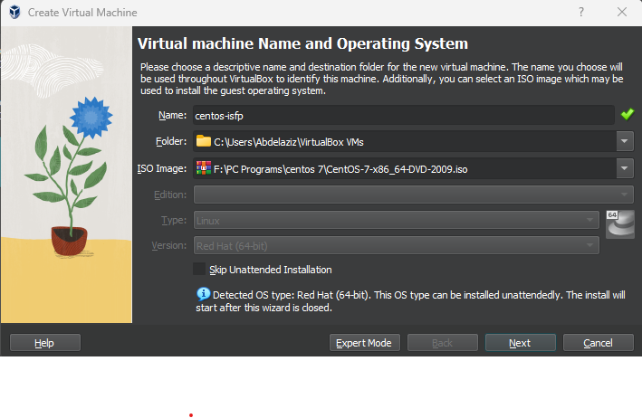
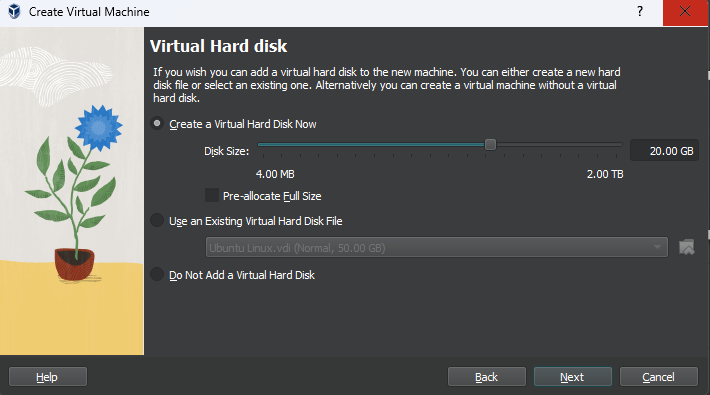
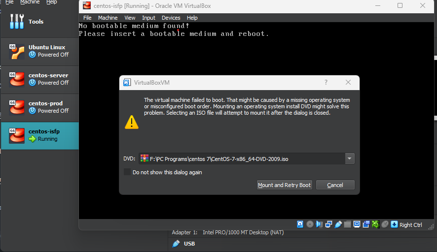
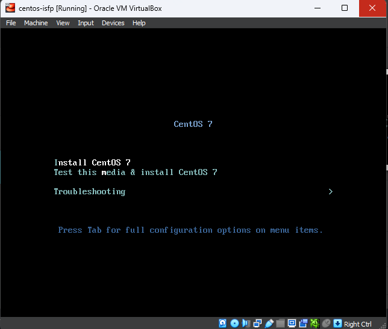
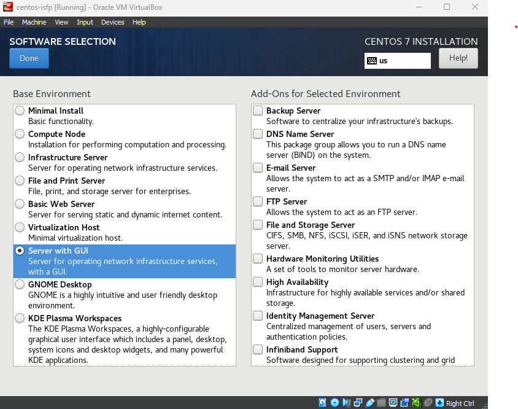
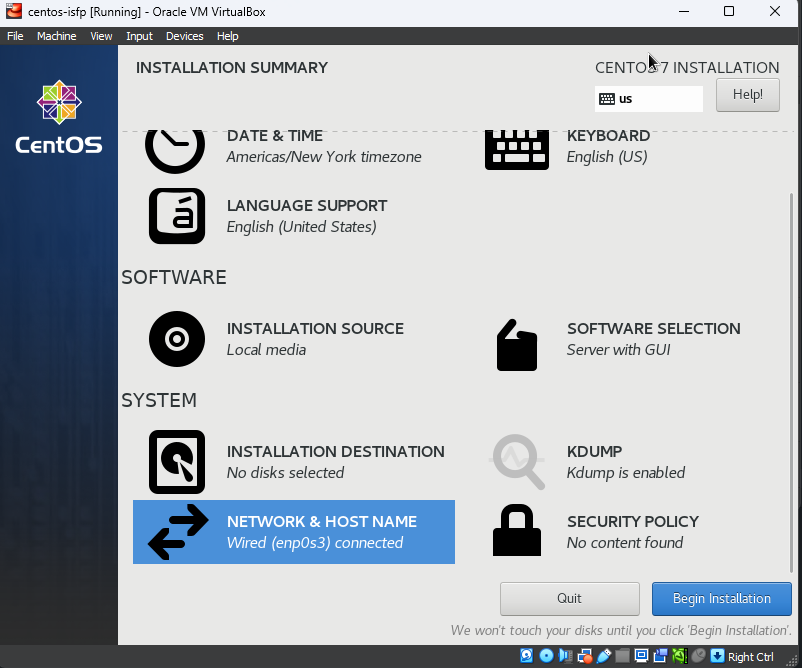
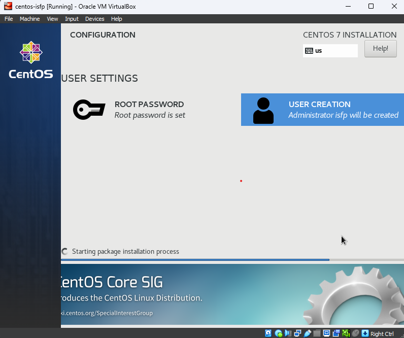
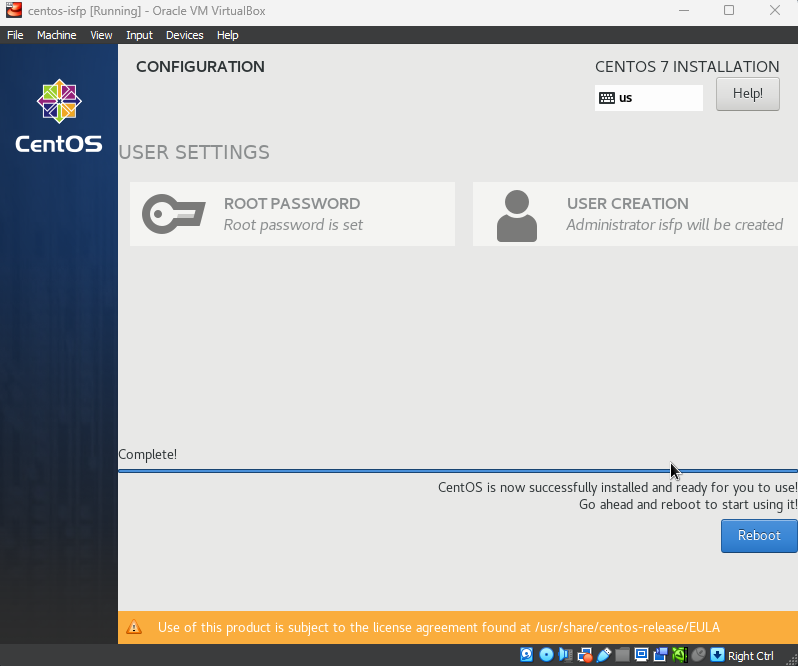

# ISFP DevOps TASK README


## Table of Contents

1. [Introduction](#introduction)
2. [Project Progress](#project-progress)
3. [Tools](#tools)
4. [Prerequisites](#prerequisites)
5. [Installation Guide](#installation-guide)
6. [Access Bootstrap Server](#access-bootstrap-server)
7. [Pictures](#pictures)

## Introduction

This project aims to provide a comprehensive guide for setting up a development environment on a CentOS 7.9 virtual machine (VM). The environment includes various components such as Apache Tomcat, Subversion (SVN), Maven, Apache, PHP, Payara Server, multiple versions of Java, WebLogic Server, Jenkins, Docker, and Ansible.

## Project Progress

- [x] `Done` - [001 - Install CentOS 7.9 as VM](#vm-installation-guide)
- [x] `Done` - [002 - Install Multiple Versions of Java](#java-installation-guide)
<!-- - [x] `Done` - 002 - Install Apache Tomcat 6.0.37.0 Application Server
- [x] `Done` - 003 - Install Subversion (SVN)
- [x] `Done` - 004 - Download the latest version of Maven and configure its repository.
- [x] `Done` - 005 - Install Apache and PHP
- [x] `Done` - 006 - Create File Comparison Script
- [ ] `Progress` - 007 - Install Payara Server 5.191 #badassfish (build 94)
- 
- [x] `Done` - 009 - Install WebLogic Server 12.2.1.3.0
- [x] `Done` - 010 - Create Jenkins Server Based on Docker Image
- [x] `Done` - 011 - Create Maven Docker Compiler
- [x] `Done` - 012 - Create Jenkins Pipeline for Automated Compilation
- [x] `Done` - 013 - Launch Jenkins Downstream Pipeline with Ansible
- [x] `Done` - 014 - Configure Local Host Server with Ansible
- [x] `Done` - 015 - Deploy App on Tomcat Docker Container -->


## VM Installation Guide

<details>
<summary><b>Show instructions</b></summary>

1. Download the CentOS 7.9 ISO Image From centos.interhost

    ```sh
    http://centos.interhost.net.il/7.9.2009/isos/x86_64/
    ```

2. Install Oracle VM Box From Oracle Download Page
    - For Windows users, download the appropriate Windows installer from the Oracle Download Page:

        ```sh
        https://www.oracle.com/eg/virtualization/technologies/vm/downloads/virtualbox-downloads.html
        ```

    - Note: If you are using a different operating system, make sure to download the version suitable for your OS.


### 1. Adding a new virtual machine depends on our proper OS ISO (CentOS 7.9)



### 2. Adjusting our virtual machine's hardware (CPU, RAM) to fit our desires


### 3. Adjusting our virtual machine's hard disk that fit our desires



### 4. After finishing our configuration above, that is the summary table of our configuration that we have made


### 5. Let's run our centos-isfp VM , I prompted to mount the ISO file



### 6. At the boot menu, we chose to install CentOS 7.



### 7. At software selection, I chose a CentOS server with a GUI



### 8. Our Installation is now completed



### 9. Installation Progress..



### 10. CentOs is now successfully installed and ready to use


</details>


## VM Java Guide

<details>
<summary><b>Show instructions</b></summary>

 <ins>Install Multiple Versions of Java and Set Default (Java 8)</ins>

This Ansible playbook automates the installation of multiple versions of Java on a target system and sets the earlier version (Java 8) as the default. It provides flexibility for developers who may require different Java versions for their projects.

</details>
