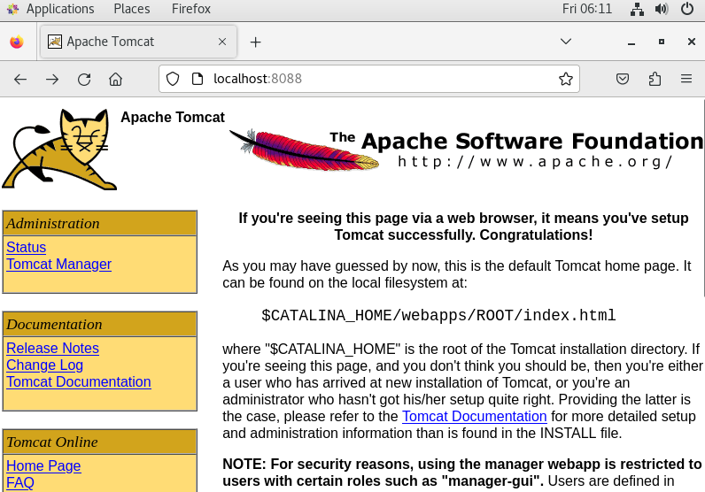
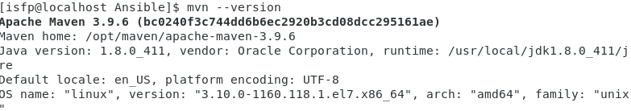
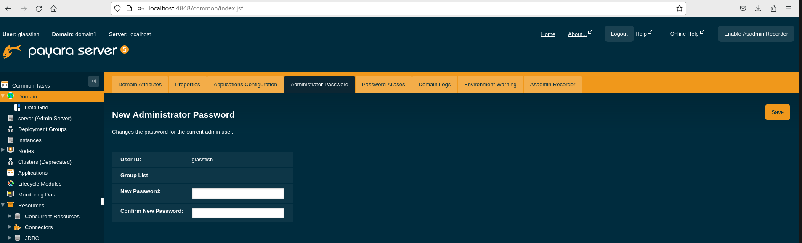
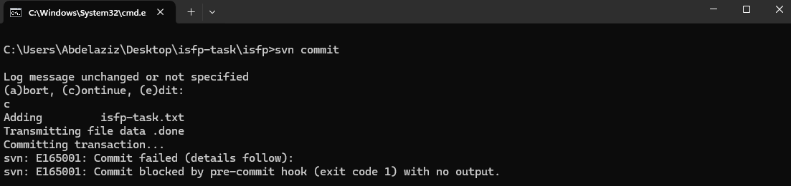
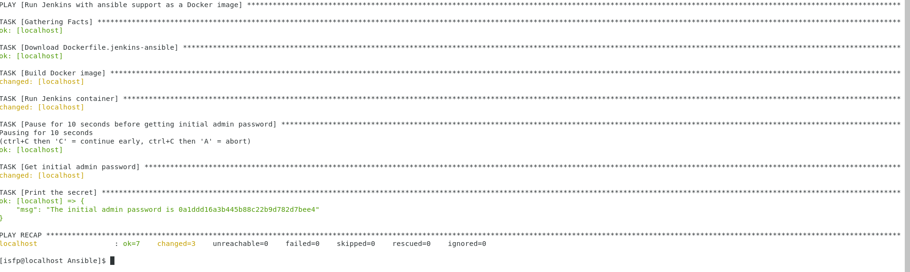
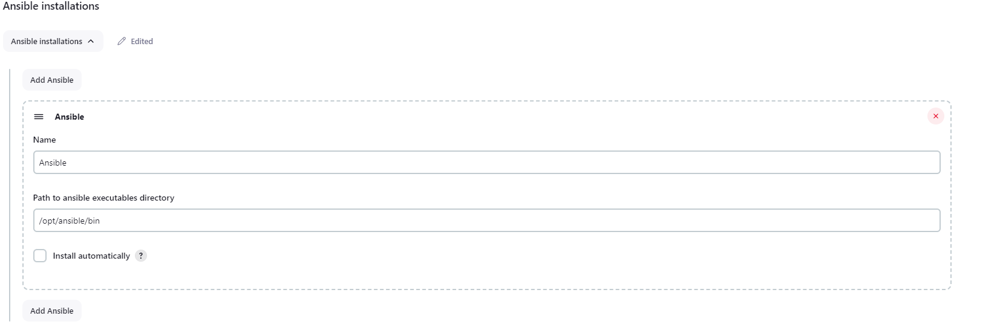
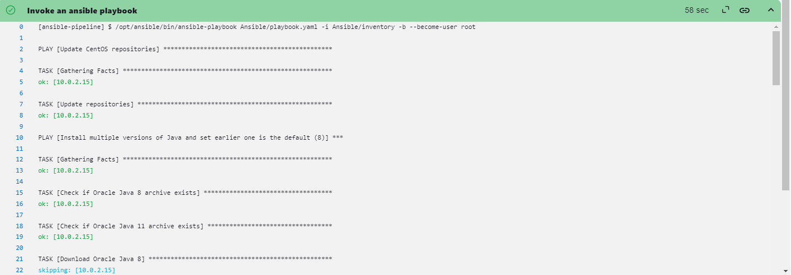
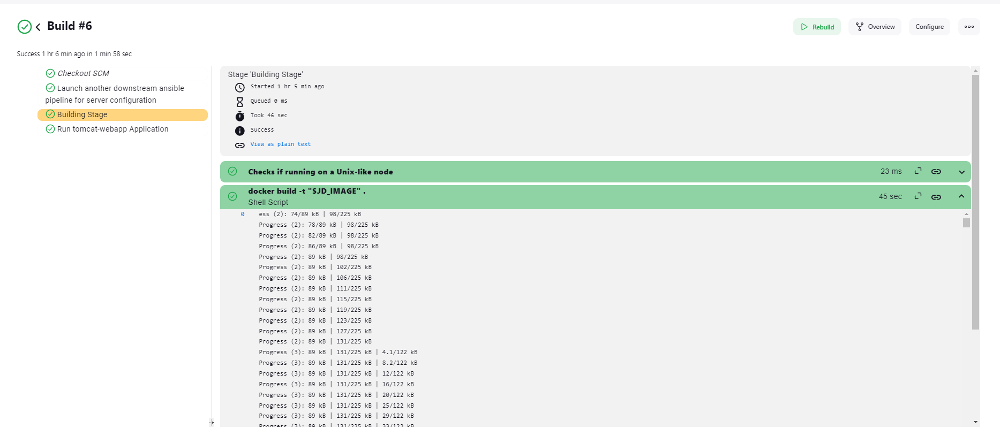

# ISFP DevOps TASK README


## :bulb: Table of Contents

1. [Introduction](#introduction)
2. [Project Progress](#project-progress)
2. [Important Notes](#important-notes)

## :reminder_ribbon: Introduction

This project aims to provide a comprehensive guide for setting up a development environment on a CentOS 7.9 virtual machine (VM). The environment includes various components such as Apache Tomcat, Subversion (SVN), Maven, Apache, PHP, Payara Server, multiple versions of Java, WebLogic Server, Jenkins, Docker, and Ansible.

## :pushpin: Project Progress

- [x] `Done` - [001 - Install CentOS 7.9 as VM](#vm-installation-guide)
- [x] `Done` - [002 - Install Multiple Versions of Java](#java-installation-guide)
- [x] `Done` - [003 - Install Apache Tomcat 6.0.37.0 Application Server](#apache-tomcat-installation-guide)
- [x] `Done` - [004 - Download the latest version of Maven and configure its repository](#maven-installation-guide)
- [x] `Done` - [005 - Install WebLogic Server 12.2.1.3.0](#weblogic-server-installation-guide)
- [x] `Done` - [006 - Install PHP, Apache and Docker](#php-apache-docker-installation-guide)
- [x] `Done` - [007 - Install Subversion “SVN” on your VM](#subversion-installation-guide)
- [x] `Done` - [008 - Create shell or python script to check and compare between two files](#compare-script-guide)
- [x] `Done` - [009 - Create Jenkins server based on docker image](#jenkins-image-installation-guide)
- [x] `Done` - [010 - Create maven docker compiler with attached non root cached repositries](#maven-docker-image-installation-guide)
- [x] `Done` - [011 - Create Jenkins pipeline that use ansible for configure local host server](#create-jenkins-pipeline)
- [x] `Done` - [012-13 - Create Jenkins pipeline that automate git fetch from webhook and compiled source code base on docker image and Launch Jenkins another downstream pipeline called ansible pipeline](#jenkins-automate-git-pipeline)

<!-- -
- [x] `Done` - 003 - Install Subversion (SVN)
- [x] `Done` - 005 - Install Apache and PHP
- [x] `Done` - 006 - Create File Comparison Script
- [ ] `Progress` - 007 - Install Payara Server 5.191 #badassfish (build 94)
- 
- [x] `Done` - 009 - Install WebLogic Server 12.2.1.3.0
- [x] `Done` - 010 - Create Jenkins Server Based on Docker Image
- [x] `Done` - 011 - Create Maven Docker Compiler
- [x] `Done` - 012 - Create Jenkins Pipeline for Automated Compilation
- [x] `Done` - 013 - Launch Jenkins Downstream Pipeline with Ansible
- [x] `Done` - 014 - Configure Local Host Server with Ansible
- [x] `Done` - 015 - Deploy App on Tomcat Docker Container -->


## VM Installation Guide

<details>
<summary><b>Show more details</b></summary>

1. Download the CentOS 7.9 ISO Image From centos.interhost

    ```sh
    http://centos.interhost.net.il/7.9.2009/isos/x86_64/
    ```

2. Install Oracle VM Box From Oracle Download Page
    - For Windows users, download the appropriate Windows installer from the Oracle Download Page:

        ```sh
        https://www.oracle.com/eg/virtualization/technologies/vm/downloads/virtualbox-downloads.html
        ```

    - Note: If you are using a different operating system, make sure to download the version suitable for your OS.


<details>
<summary><b>Images</b></summary>

### 1. Adding a new virtual machine depends on our proper OS ISO (CentOS 7.9)


### 2. Adjusting our virtual machine's hardware (CPU, RAM) to fit our desires


### 3. Adjusting our virtual machine's hard disk that fit our desires


### 4. After finishing our configuration above, that is the summary table of our configuration that we have made


### 5. Let's run our centos-isfp VM , I prompted to mount the ISO file


### 6. At the boot menu, we chose to install CentOS 7.


### 7. At software selection, I chose a CentOS server with a GUI


### 8. Our Installation is now completed


### 9. Installation Progress..


### 10. CentOs is now successfully installed and ready to use


</details>
</details>

## Java Installation Guide

<details>
<summary><b>Show more details</b></summary>

# Installing  Multiple Versions of Java and Set Default (Java 8)
This Ansible playbook automates the installation of various Java versions on a target machine, with the earlier version (Java 8) set as the default. It gives developers the flexibility they need if their applications require different Java versions.
I choose to install Oracle Java (8,11) versions since WebLogic installation cannot be proceed because the open-jdk is no longer supported any more.

# Prerequisites
Ensure the following prerequisites are met before running the playbook:

- **Access to Oracle Java Archives:** Ensure access to the Oracle Java archives for Java 8 and Java 11 versions. The playbook uses direct download links to fetch these archives. and those direct links are temporary because to download from the Oracle page, you have to sign in and accept the Oracle OTN license and terms.
So I got those links from my login session; they have a limit 3 times only to be downloaded. Of course,  this is not the best approach. You can download them and upload them to a central server; you can use S3 buckets or any other service for example.
- **Ansible:**  Ensure Ansible is installed on the local system from which the playbook will be executed.
- **Target Host:**  The playbook assumes execution on the localhost, but it can be modified to target other hosts as needed.

# Playbook Structure


```yaml
- name: Install multiple versions of Java and set earlier one is the default (8)
  hosts: localhost
  become: yes
  vars:
    java8_download_url: https://download.oracle.com/otn/java/jdk/8u411-b09/43d62d619be4e416215729597d70b8ac/jdk-8u411-linux-x64.tar.gz?AuthParam=1715329607_1d701ac9a940bea9f0e903935ba46eb1
    java11_download_url: https://download.oracle.com/otn/java/jdk/11.0.23+7/9bd8d305c900ee4fa3e613b59e6f42de/jdk-11.0.23_linux-x64_bin.tar.gz?AuthParam=1715329784_6c64b1935760ee8cd8f61cc325d75b82
    download_folder: /tmp
    java_8_home: "/usr/local/jdk1.8.0_411"
    java_11_home: "/usr/local/jdk-11.0.23"
    java_8_archive: "{{download_folder}}/jdk-8u411-linux-x64.tar.gz"
    java_11_archive: "{{download_folder}}/jdk-11.0.23_linux-x64_bin.tar.gz"
    java_env_file: "/etc/profile.d/java.sh"
  tasks:
    - name: Check if Oracle Java 8 archive exists
      stat:
        path: "{{ java_8_archive }}"
      register: java_8_archive_stat

    - name: Check if Oracle Java 11 archive exists
      stat:
        path: "{{ java_11_archive }}"
      register: java_11_archive_stat

    - name: Download Oracle Java 8
      command: "curl -v -L -b oraclelicense=accept-securebackup-cookie -o {{java_8_archive}}  {{java8_download_url}}"
      when: java_8_archive_stat.stat.exists == False

    - name: Download Oracle Java 11
      command: "curl -v -L -b oraclelicense=accept-securebackup-cookie -o {{java_11_archive}}  {{java11_download_url}}"
      when: java_11_archive_stat.stat.exists == False

    - name: Unpack archive Oracle Java 8
      unarchive:
        src: "{{java_8_archive}}"
        dest: /usr/local
        remote_src: yes

    - name: Unpack archive Oracle Java 11
      unarchive:
        src: "{{java_11_archive}}"
        dest: /usr/local
        remote_src: yes

    - name: Install Oracle Java 8
      command: 'update-alternatives --install "/usr/bin/java" "java" "{{java_8_home}}/jre/bin/java" 1'
    - name: Install Oracle Java 11
      command: 'update-alternatives --install "/usr/bin/java" "java" "{{java_11_home}}/jre/bin/java" 1'
    - name: Set Oracle Java 8 as default
      command: "update-alternatives --set java {{java_8_home}}/jre/bin/java"

    - name: Create /etc/profile.d directory
      file:
        path: /etc/profile.d
        state: directory

    - name: Create java.sh file
      file:
        path: "{{java_env_file}}"
        state: touch

    - name: Clear content of java.sh file if it exists
      shell: echo "" > "{{ java_env_file }}"

    - name: Set environment variables for JAVA
      lineinfile:
        dest: "{{ java_env_file }}"
        line: |
          export JAVA_HOME={{java_8_home}}
          export PATH=$PATH:$JAVA_HOME/bin

    - name: Source java.sh script
      shell: source {{java_env_file}}
      args:
        executable: /bin/bash
```  


- **hosts:**  Specifies the target host where the playbook tasks will be executed. In this case, it's set to localhost.
- **vars:**   Defines variables used throughout the playbook, including download URLs for Java 8 and Java 11 archives, download folder location, installation paths, and environment file paths.
- **tasks:** Contains the main tasks of the playbook
  - **Check if Oracle Java archives exist:** Utilizes the `stat` module to check if the Java archives are already downloaded.
  - **Download Oracle Java archives:** Downloads the Java archives using `curl` commands if they don't already exist.
  - **Unpack archives:** Uses the `unarchive` module to extract the downloaded Java archives to the specified destination folder `(/usr/local)`.
  - **Install Java versions:** Uses `update-alternatives` to install Java versions and set up symbolic links to the Java executable.
  - **Set default Java version:** Uses `update-alternatives` Sets Java 8 as the default version using update-alternatives.
  - **Export environment variables:** Appends Java environment variables to the system-wide profile file `(/etc/profile.d/java.sh)` to make Java Home available globally.
  - **Source java.sh script:**  Sources the java.sh script to ensure the environment variables take effect immediately.


<details>
<summary><b>Images</b></summary>

### 1. Executing ansible playbook to our vm


### 2. update-alternatives --config java --> shows us the default java version which is openjdk-8


### 3. after installing ORACLE java , that is our JAVA_HOME Environment variable


### 4. Oracle Java Version


### 5. update-alternatives --config java --> shows us the default Java version, which is Oracle 8, that we have installed


</details>
</details>


## Apache Tomcat Installation Guide

<details>
<summary><b>Show more details</b></summary>

# Installing Apache Tomcat (6.0.37)

This Ansible playbook automates the installation of Apache Tomcat version 6.0.37 on our local machine. It performs the following steps:


# Prerequisites

Ensure the following prerequisites are met before running the playbook:

- **Access to Apache Tomcat Archive:** Ensure access to the Apache Tomcat archives for 6.0.37. The playbook uses direct download link to fetch this archive. 
- **Ansible:**  Ensure Ansible is installed on the local system from which the playbook will be executed.
- **Target Host:**  The playbook assumes execution on the localhost, but it can be modified to target other hosts as needed.

# Playbook Structure

```yaml
- name: Install Apache Tomcat 6.0.37
  hosts: localhost
  become: yes
  vars:
    download_url: https://archive.apache.org/dist/tomcat/tomcat-6/v6.0.37/bin/apache-tomcat-6.0.37.tar.gz
    download_folder: /tmp
    tomcat_installation_path: "/opt/tomcat"
    tomcat_home: "/opt/tomcat/apache-tomcat-6.0.37"
    tomcat_archive: "{{download_folder}}/apache-tomcat-6.0.37.tar.gz"
  tasks:
    - name: Create tomcat directory
      file:
        path: "{{tomcat_installation_path}}"
        state: directory

    - name: Download Apache Tomcat
      get_url:
        url: "{{download_url}}"
        dest: "{{tomcat_archive}}"

    - name: Extract Apache Tomcat
      unarchive:
        src: "{{tomcat_archive}}"
        dest: "{{tomcat_installation_path}}"
        remote_src: yes

    - name: Change permissions of startup.sh
      file:
        path: "{{tomcat_home}}/bin/startup.sh"
        mode: +x

    - name: Change Tomcat connector port to 8088
      replace:
        path: "{{tomcat_home}}/conf/server.xml"
        regexp: 'port="8080"'
        replace: 'port="8088"'

    - name: Change Tomcat Shutdown Port 8005 > 8006
      replace:
        path: "{{tomcat_home}}/conf/server.xml"
        regexp: 'port="8005"'
        replace: 'port="8006"'

    - name: Change Tomcat Connector Port for AJP 8009 > 8010
      replace:
        path: "{{tomcat_home}}/conf/server.xml"
        regexp: 'port="8009"'
        replace: 'port="8010"'

    - name: Create tomcat-users.xml file
      template:
        src: "./tomcat/tomcat-users.xml"
        dest: "{{tomcat_home}}/conf/tomcat-users.xml"

    - name: Start Tomcat service using startup.sh
      command: sh "{{tomcat_home}}/bin/startup.sh"

    - name: Check if Tomcat service is running
      shell: ps aux | grep '[c]atalina.home=/opt/tomcat'
      register: tomcat_status
      ignore_errors: yes

    - name: Debug message Tomcat status
      debug:
        msg: "Tomcat is {{ 'running' if tomcat_status.rc == 0 else 'not running' }}"
```  

- **hosts:**  Specifies the target host where the playbook tasks will be executed. In this case, it's set to localhost.
- **vars:**   Defines variables used throughout the playbook, including download URL Apache tomcat archive, download folder location, installation paths, and environment file paths.
- **tasks:** Contains the main tasks of the playbook
  - **Create Tomcat Directory:** It creates the directory where Apache Tomcat will be installed.
  - **Download Apache Tomcat Archive:** It downloads the Apache Tomcat archive distribution from the provided URL and saves it to a specified folder.
  - **Extract Apache Tomcat:** It extracts the downloaded Apache Tomcat archive to the installation directory.
  - **Change Permissions of startup.sh:**  It changes the permissions of the Tomcat startup script to make it executable.
  - **Change Tomcat Connector Port** It modifies the configuration file to change the default connector port from `8080` to `8088`.
  - **Modify Tomcat Shutdown Port:**  It modifies the configuration file to change the shutdown port from `8005` to `8006`.
  - **Modify Tomcat Connector Port for AJP:**  It modifies the configuration file to change the port used for the AJP connector from `8009` to `8010`.
  - **Create tomcat-users.xml File:**   It creates a tomcat-users.xml file in the Tomcat configuration directory to define user roles and access privileges.

    ```diff
    <?xml version='1.0' encoding='utf-8'?>
    <!--
    Licensed to the Apache Software Foundation (ASF) under one or more
    contributor license agreements.  See the NOTICE file distributed with
    this work for additional information regarding copyright ownership.
    The ASF licenses this file to You under the Apache License, Version 2.0
    (the "License"); you may not use this file except in compliance with
    the License.  You may obtain a copy of the License at

        http://www.apache.org/licenses/LICENSE-2.0

    Unless required by applicable law or agreed to in writing, software
    distributed under the License is distributed on an "AS IS" BASIS,
    WITHOUT WARRANTIES OR CONDITIONS OF ANY KIND, either express or implied.
    See the License for the specific language governing permissions and
    limitations under the License.
    -->
    <tomcat-users>
    <!--
    NOTE:  By default, no user is included in the "manager-gui" role required
    to operate the "/manager/html" web application.  If you wish to use this app,
    you must define such a user - the username and password are arbitrary.
    -->
    <!--
    NOTE:  The sample user and role entries below are wrapped in a comment
    and thus are ignored when reading this file. Do not forget to remove
    <!.. ..> that surrounds them.
    -->
    <!--
    <role rolename="tomcat"/>
    <role rolename="role1"/>
    <user username="tomcat" password="tomcat" roles="manager-gui,admin-gui"/>
    <user username="both" password="tomcat" roles="tomcat,role1"/>
    <user username="role1" password="tomcat" roles="role1"/>
    -->
    + <user username="tomcat" password="tomcat" roles="manager-gui,admin-gui"/>
    </tomcat-users>
    ```

  - **Start Tomcat Service:**  It starts the Tomcat service using the `startup.sh` script.
  - **Check Tomcat Service Status:** It verifies whether the Tomcat service is running by searching for the process using ps command.
  - **Debug Message:** It provides a debug message indicating whether Tomcat is running or not.


  


<details>
<summary><b>Images</b></summary>

### 1. Executing ansible playbook to our vm


### 2. Accessing our apache tomcat from our VM



### 3. Accessing our apache tomcat from my computer which host the VM


> Assuming that our virtual machine (VM) is accessible to the public, I wanted to emulate the process, so I used the command `sudo firewall-cmd --zone=public --add-port=8088/tcp to open port 8080 within our VM. I also adjusted the VM network settings from our oracle VMbox to port forward from my host machine to the VM (guest) port.


### 4. Trying to login into manager page


### 5. I logged in successfully


### 6. Apache tomcat server status


</details>
</details>


## Maven Installation Guide

<details>
<summary><b>Show more details</b></summary>

# Installing Maven Latest Version (3.9.6)

This Ansible playbook automates the installation of Apache Maven version 3.9.6 on our local machine. It performs the following steps:

# Prerequisites

Ensure the following prerequisites are met before running the playbook:

- **Access to Apache Maven Archive:** Ensure access to the Apache Maven archives for 3.9.6. The playbook uses direct download link to fetch this archive.
- **Ansible:**  Ensure Ansible is installed on the local system from which the playbook will be executed.
- **Target Host:**  The playbook assumes execution on the localhost, but it can be modified to target other hosts as needed.

# Playbook Structure

```yaml
- name: Install Apache Maven and configure environment
  hosts: localhost
  become: yes
  vars:
    download_url: https://dlcdn.apache.org/maven/maven-3/3.9.6/binaries/apache-maven-3.9.6-bin.tar.gz
    download_folder: /tmp
    maven_installation_path: "/opt/maven"
    maven_home: "/opt/maven/apache-maven-3.9.6"
    maven_archive: "{{download_folder}}/apache-maven-3.9.6-bin.tar.gz"
    maven_env_file: "/etc/profile.d/maven.sh"

  tasks:
    - name: Download Maven
      get_url:
        url: "{{ download_url }}"
        dest: "{{ maven_archive }}"

    - name: Create maven.sh
      file:
        path: "{{ maven_installation_path }}"
        state: directory

    - name: Extract Maven
      unarchive:
        src: "{{ maven_archive }}"
        dest: "{{ maven_installation_path }}"
        creates: "{{ maven_home }}"
        remote_src: yes

    - name: Create maven.sh
      file:
        path: "{{ maven_env_file }}"
        state: touch

    - name: Clear content of maven.sh file if it exists
      shell: echo "" > "{{ maven_env_file }}"

    - name: Set environment variables for Maven
      lineinfile:
        dest: "{{ maven_env_file }}"
        line: "{{ item }}"
      with_items:
        - "export M2_HOME={{maven_home}}"
        - "export PATH=$PATH:$M2_HOME/bin"

    - name: Configure maven repo to use local repo
      copy:
        src: "./maven/settings.xml"
        dest: "{{ maven_home }}/conf/settings.xml"

    - name: Source maven.sh script
      shell: source {{ maven_env_file }}
      args:
        executable: /bin/bash
```  

- **hosts:**  Specifies the target host where the playbook tasks will be executed. In this case, it's set to localhost.
- **vars:**   Defines variables used throughout the playbook, including download URL Apache maven archive, download folder location, installation paths, and environment file paths.
- **tasks:** Contains the main tasks of the playbook
  - **Download Maven:** It downloads the Apache Maven binary distribution from the specified URL and saves it to a temporary folder.
  - **Create Maven Installation Directory:** It creates the directory where Apache Maven will be installed..
  - **Extract Maven:** It creates a script file `(maven.sh)` in the /etc/profile.d directory to set up environment variables for Maven.
  - **Clear Content of maven.sh File:** It clears the content of the maven.sh file if it exists.
  - **Set Environment Variables for Maven**  It sets environment variables `M2_HOME` and updates the PATH variable to include the Maven bin directory.
  - **Configure Maven Repository**  It copies a custom Maven `settings.xml` file to the Maven installation directory to configure Maven repository settings.
  - **Source maven.sh Script**  It sources the `maven.sh` script to apply the environment variable changes immediately.


<details>
<summary><b>Images</b></summary>

### 1. Executing ansible playbook to our vm


### 2. Maven has installed successfully



</details>
</details>


## WebLogic Server Installation Guide

<details>
<summary><b>Show more details</b></summary>

# Installing WebLogic Server Version (12.2.1.3.0)

This guide steps for installation of WebLogic Server 12.2.1.3.0 on our local machine. The download step is done manually due the the large size
and the GUI Wizard installation

# Prerequisites

Ensure the following prerequisites are met before installing WebLogic Server:

- **Oracle Java 8 :**  Ensure Oracle Java 8  is installed on the local system.
- **fmw_12.2.1.3.0_wls_Disk_1_1of1.zip :** [Download](https://www.oracle.com/middleware/technologies/weblogic-server-installers-downloads.html)


# Steps

- After downloading the `fmw_12.2.1.3.0_wls_Disk1_1of1.zip` in downloads directory fellow this steps:
  - **Change Directory to {user}/downloads**: `cd ~/Downloads`
  - **Extract the WebLogic Installer .zip file**: `unzip fmw_12.2.1.3.0_wls_Disk1_1of1.zip`
  - **Run the WebLogic installer**: `java -jar fmw_12.2.1.3.0_wls.jar`

<details>
<summary><b>Images</b></summary>


</details>
</details>


Shaaaaah

## Payara Server Installation Guide

<details>
<summary><b>Show more details</b></summary>

# Installing Payara Server 5.191 #badassfish (build 94)

This guide steps for installation of 5.191 #badassfish (build 94) on our local machine.

# Prerequisites

Ensure the following prerequisites are met before installing WebLogic Server:

- **Oracle Java 8 :**  Ensure Oracle Java 8  is installed on the local system.
- **payara-5.191.zip :** [Download](https://repo1.maven.org/maven2/fish/payara/distributions/payara/5.191/)

# Steps

- After downloading the `payara-5.191.zip` in downloads directory fellow this steps:
  - **Change Directory to {user}/downloads**: `cd ~/Downloads`
  - **Extract the Payara Server Installer .zip file**: `unzip payara-5.191.zip`
  - **Change Directory to {user}/downloads/payara5/bin**: `cd payara5/bin`
  - **Start the Payara Server**: `./asadmin start-domain domain1`

<details>
<summary><b>Images</b></summary>

### 1. Starting our payara domain


### 3. Payara server version


### 4. Payara server default admin username


### 4. Changing default admin username to glassfish

 ```sh
 By editing /home/isfp/Downloads/payara5/glassfish/domains/domain1/config/admin-keyfile
 ```



</details>
</details>


## PHP Apache Docker Installation Guide

<details>
<summary><b>Show more details</b></summary>

# Installing PHP Apache Docker

This Ansible playbook automates the installation of Apache (httpd) and PHP packages on your local machine, 
along with setting up Docker for containerized applications. Here's a breakdown of the tasks performed:

# Prerequisites

Ensure the following prerequisites are met before running the playbook:

- **Ansible:**  Ensure Ansible is installed on the local system from which the playbook will be executed.
- **Target Host:**  The playbook assumes execution on the localhost, but it can be modified to target other hosts as needed.

# Playbook Structure

```yaml
- name: Install Apache and PHP
  hosts: localhost
  become: yes

  tasks:
    - name: Install apache(httpd)
      yum:
        name: httpd
        state: present

    - name: Install php package
      yum:
        name: php
        state: present
    - name: Add Docker repository
      yum_repository:
        name: docker-ce
        description: Docker CE Stable - $basearch
        baseurl: https://download.docker.com/linux/centos/7/$basearch/stable
        gpgcheck: yes
        gpgkey: https://download.docker.com/linux/centos/gpg
        enabled: yes

    - name: Install Docker
      yum:
        name: docker-ce
        state: present

    - name: Start Docker service
      service:
        name: docker
        state: started
        enabled: yes

    - name: Change permissions of /var/run/docker.sock
      file:
        path: /var/run/docker.sock
        mode: "0666"

```  


- **tasks:** Contains the main tasks of the playbook
  - **Install Apache (httpd):** : It installs the Apache web server package `(httpd)` using the yum package manager.
  - **Install PHP Package:**It installs the `PHP` package using yum to enable server-side scripting support.
  - **Add Docker Repository:** It adds the `Docker repository` to the system configuration to fetch `Docker packages`.
  - **Install Docker File:**  It installs `Docker CE (Community Edition)` using the Docker repository configured earlier.
  - **Start Docker Service**   It starts the `Docker service` and ensures that it is enabled to start automatically on system boot.
  - **Change Permissions of `/var/run/docker.sock`** It adjusts the `permissions` of the Docker socket file to allow Docker commands to be executed without `requiring root privileges`.

<details>
<summary><b>Images</b></summary>

### 1. Executing ansible playbook to our vm


</details>
</details>


## Subversion Installation Guide

<details>
<summary><b>Show more details</b></summary>

# Install Subversion “SVN” on our VM

- Add user svn authorized to Read/Write on svn://localhost/A/B/C
- Force user to add comment before commit.

TThis guide outlines the steps to configure a Subversion (SVN) server using Ansible automation tool. SVN is a version control system commonly used for managing source code and facilitating collaboration among development teams.

# Prerequisites

Ensure the following prerequisites are met before running the script:

- **Ansible:**  Ensure Ansible is installed on the local system from which the playbook will be executed.
- **Target Host:**  The playbook assumes execution on the localhost, but it can be modified to target other hosts as needed.

# Playbook Structure

```yaml
- name: Install SVN
  hosts: localhost
  become: yes
  vars:
    subversion_conf: /etc/httpd/conf.modules.d/10-subversion.conf
    svn_repos_home: /svn
    svn_accounts_home: /etc/svn
  tasks:
    - name: Install subversion
      yum:
        name: subversion
        state: present

    - name: Install mod_dav_svn
      yum:
        name: mod_dav_svn
        state: present

    - name: Clear content of 10-subversion.conf file if it exists
      shell: echo "" > "{{ subversion_conf }}"

    - name: Set environment variables for JAVA
      lineinfile:
        dest: "{{ subversion_conf }}"
        line: "{{ item }}"
      with_items:
        - "LoadModule dav_svn_module     modules/mod_dav_svn.so"
        - "LoadModule authz_svn_module   modules/mod_authz_svn.so"
        - "LoadModule dontdothat_module  modules/mod_dontdothat.so"
        - " "
        - " "
        - "<Location /svn>"
        - "DAV svn"
        - "SVNParentPath /svn"
        - 'AuthName "SVN Repos"'
        - "AuthType Basic"
        - "AuthUserFile /etc/svn/svn-auth"
        - "AuthzSVNAccessFile /svn/authz"
        - "Require valid-user"
        - "</Location>"

    - name: Create SVN Directory
      file:
        path: "{{svn_repos_home}}"
        state: directory

    - name: Create SVN Repos Directory
      command: "svnadmin create {{svn_repos_home}}/isfp"

    - name: "Change permissions of {{svn_repos_home}}/isfp"
      file:
        path: "{{svn_repos_home}}/isfp"
        owner: apache
        group: apache
        recurse: yes

    - name: Create SVN User Accounts Directory
      file:
        path: "{{svn_accounts_home}}"
        state: directory
        mode: "0755"

    - name: Create svn-auth file
      file:
        path: "{{svn_accounts_home}}/svn-auth"
        state: touch

    - name: "Change permissions of {{svn_accounts_home}}/svn-auth"
      file:
        path: "{{svn_accounts_home}}/svn-auth"
        owner: root
        group: apache
        mode: 0640

    - name: Setup permissions for users
      copy:
        src: "./svn/authz"
        dest: "{{ svn_repos_home }}/authz"

    - name: "Change SELinux context of {{svn_repos_home}}/authz"
      command: "chcon -R -t httpd_sys_content_t {{svn_repos_home}}/authz"

    - name: "Change SELinux context of {{svn_repos_home}}"
      command: "chcon -R -t httpd_sys_rw_content_t {{svn_repos_home}}"

    - name: "Change SELinux context of {{svn_repos_home}}"
      command: "chcon -t httpd_exec_t  {{svn_repos_home}}/isfp/pre-commit"

    - name: Start and enable httpd service
      systemd:
        name: httpd
        state: started
        enabled: yes

    - name: Start SVN server
      command: "svnserve -d -r {{svn_repos_home}}"
      ignore_errors: true

```  

<details>
<summary><b>Images</b></summary>

### 1. Executing ansible playbook to our vm


### 2. Accessing our ISFP repo From Chrome


### 3. Accessing our ISFP repo From TortoiseSVN


### 4. checking out to our repo form Windows CMD


### 5. Adding a new file 


### 5. Trying to commit it and Committing blocked by pre-commit webhook located into the repo/hooks directory



### 6. The commit Successfully committed


### 7. The new revision updated


</details>
</details>


## Compare Script Guide

<details>
<summary><b>Show more details</b></summary>

# Loading Lines into Dictionary and Comparing Source with Destination

This Python script automates the process of comparing lines from a source file with multiple destination files and outputs the results into an output file. Here's how it works:


# Prerequisites

Ensure the following prerequisites are met before running the script:

- **Python:**  Ensure Python is installed on the local system from which the script will be executed.

# Script Structure

```yaml
import os

def load_lines_into_dict(directory_path):
    files_in_directory = os.listdir(directory_path)
    lines_found = {}
    for file_name in files_in_directory:
        file_path_abs = os.path.join(directory_path, file_name)
        if os.path.isfile(file_path_abs):
            with open(file_path_abs, 'r') as file:
                for line in file:
                    file_name_only = os.path.basename(file_path_abs)
                    if line.strip() not in lines_found:
                        lines_found[line.strip()] = [file_name_only]
                    else:
                        lines_found[line.strip()].append(file_name_only)
    return lines_found

def compare_lines_src_dest(lines_dict, output_file):
    with open("source.txt", 'r') as source_file:
        with open(output_file, 'w') as result_file:
            for line in source_file:
                line = line.strip()
                if line in lines_dict:
                    result_file.write(f"{line}'{', '.join(lines_dict[line])}\n")

lines_dict = load_lines_into_dict("./Destination")
compare_lines_src_dest(lines_dict, "output.txt")


```  

```sh
'Port_Automation/JavaSource/com/sps/billing/invoices/action/BaseAction.java'Patch 1.15.785.txt, Patch 1.21.32.txt, Patch 1.21.44.txt
'Port_Automation/JavaSource/com/sps/billing/invoices/containerinvoice/loaddischargeinvoice/service/spring/BillingContainerLoadDischargeService.java'Patch 1.21.09.txt
'Port_Automation/JavaSource/com/sps/billing/service/IBillingService.java'Patch 1.15.785.txt, Patch 1.21.09.txt, Patch 1.21.106.txt, Patch 1.21.32.txt, Patch 1.21.98.txt
'Port_Automation/JavaSource/com/sps/billing/service/spring/BillingService.java'Patch 1.15.785.txt, Patch 1.21.09.txt, Patch 1.21.106.txt, Patch 1.21.13.txt, Patch 1.21.16.txt, Patch 1.21.32.txt, Patch 1.21.44.txt, Patch 1.21.98.txt
'Port_Automation/WebContent/WEB-INF/BillingApplicationContext.xml'Patch 1.15.785.txt, Patch 1.21.25.txt, Patch 1.21.32.txt, Patch 1.21.44.txt, Patch 1.21.95.txt, Patch 1.21.98.txt
'Port_Automation/JavaSource/com/sps/container/definition/dao/ContainerDefinitionDao.java'Patch 1.21.27.txt, Patch 1.21.83.txt
'Port_Automation/JavaSource/com/sps/container/definition/service/ContainerDefinitionService.java'Patch 1.21.111.txt, Patch 1.21.17.txt, Patch 1.21.27.txt, Patch 1.21.28.txt, Patch 1.21.30.txt, Patch 1.21.36.txt, Patch 1.21.51.txt, Patch 1.21.65.txt, Patch 1.21.83.txt, Patch 1.21.95.txt
'Port_Automation/JavaSource/com/sps/container/definition/service/IContainerDefinitionService.java'Patch 1.21.27.txt
'Port_Automation/JavaSource/com/sps/container/permitdismiss/action/InitPermitDismissAddEdit.java'Patch 1.21.95.txt
'Port_Automation/JavaSource/com/sps/container/permitdismiss/action/SavePermitDismissAddEdit.java'Patch 1.21.30.txt
'Port_Automation/WebContent/WEB-INF/XMLMappingResources.xml'Patch 1.15.785.txt, Patch 1.21.112.txt, Patch 1.21.124.txt, Patch 1.21.125.txt, Patch 1.21.128.txt, Patch 1.21.132.txt, Patch 1.21.32.txt, Patch 1.21.44.txt, Patch 1.21.67.txt
'Port_Automation/WebContent/WEB-INF/struts-config.xml'Patch 1.15.785.txt, Patch 1.21.10.txt, Patch 1.21.106.txt, Patch 1.21.107.txt, Patch 1.21.110.txt, Patch 1.21.114.txt, Patch 1.21.119.txt, Patch 1.21.121.txt, Patch 1.21.125.txt, Patch 1.21.128.txt, Patch 1.21.26.txt, Patch 1.21.32.txt, Patch 1.21.37.txt, Patch 1.21.39.txt, Patch 1.21.43.txt, Patch 1.21.44.txt, Patch 1.21.53.txt, Patch 1.21.56.txt, Patch 1.21.67.txt, Patch 1.21.70.txt
'Port_Automation/JavaSource/com/sps/billing/invoices/containerinvoice/collectionserviceinvoice/service/spring/BillingContainerCollectionServiceService.java'Patch 1.21.84.txt
'Port_Automation/JavaSource/com/sps/core/resources/ApplicationResources_ar.properties'Patch 1.15.785.txt, Patch 1.21.10.txt, Patch 1.21.110.txt, Patch 1.21.113.txt, Patch 1.21.114.txt, Patch 1.21.119.txt, Patch 1.21.121.txt, Patch 1.21.124.txt, Patch 1.21.125.txt, Patch 1.21.128.txt, Patch 1.21.16.txt, Patch 1.21.23.txt, Patch 1.21.25.txt, Patch 1.21.26.txt, Patch 1.21.32.txt, Patch 1.21.38.txt, Patch 1.21.39.txt, Patch 1.21.43.txt, Patch 1.21.45.txt, Patch 1.21.47.txt, Patch 1.21.49.txt, Patch 1.21.5.txt, Patch 1.21.56.txt, Patch 1.21.66.txt, Patch 1.21.67.txt, Patch 1.21.69.txt, Patch 1.21.70.txt, Patch 1.21.76.txt, Patch 1.21.83.txt
'Port_Automation/JavaSource/com/sps/container/definition/dao/IContainerDefinitionDao.java'Patch 1.21.27.txt
'Port_Automation/JavaSource/com/sps/container/permitdismiss/action/InitPermitDismissSearch.java'Patch 1.21.95.txt
'Port_Automation/JavaSource/com/sps/billing/dao/IBillingDao.java'Patch 1.21.98.txt
'Port_Automation/JavaSource/com/sps/billing/dao/hibernate/BillingDao.java'Patch 1.21.98.txt
'Port_Automation/JavaSource/com/sps/billing/invoices/gcinvoice/dao/hibernate/BillingGCDao.java'Patch 1.21.118.txt, Patch 1.21.52.txt
'Port_Automation/JavaSource/com/sps/container/definition/dao/ContainerDefinitionDao.java'Patch 1.21.27.txt, Patch 1.21.83.txt
'Port_Automation/JavaSource/com/sps/container/definition/dao/IContainerDefinitionDao.java'Patch 1.21.27.txt
'Port_Automation/JavaSource/com/sps/container/definition/service/ContainerDefinitionService.java'Patch 1.21.111.txt, Patch 1.21.17.txt, Patch 1.21.27.txt, Patch 1.21.28.txt, Patch 1.21.30.txt, Patch 1.21.36.txt, Patch 1.21.51.txt, Patch 1.21.65.txt, Patch 1.21.83.txt, Patch 1.21.95.txt
'Port_Automation/JavaSource/com/sps/container/definition/service/IContainerDefinitionService.java'Patch 1.21.27.txt
'Port_Automation/JavaSource/com/sps/billing/invoices/containerinvoice/collectionserviceinvoice/service/spring/BillingContainerCollectionServiceService.java'Patch 1.21.84.txt
'ReportViewer/WebContent/Reports/Containers/RPT03022DD.rpt'Patch 1.21.4.txt
'ReportViewer/WebContent/Reports/Containers/RPT030264.rpt'Patch 1.21.27.txt, Patch 1.21.4.txt, Patch 1.21.65.txt, Patch 1.21.8.txt
```

1. `load_lines_into_dict(directory_path)`: This function takes a directory path as input and loads all the lines from files within that directory into a dictionary. Each line is used as a key, and the value associated with each key is a list of file names where the line is found. `It iterates through each file in the directory, reads its lines`, and populates the dictionary accordingly.

2. `compare_lines_src_dest(lines_dict, output_file)`: This function compares the lines from a source file (source.txt) with the lines loaded into the dictionary using the load_lines_into_dict function. For each line in the source file,` it checks if the line exists in the dictionary`. If it does, `it writes the line along with the file names where it was found into an output file (output.txt)`.

</details>


## Jenkins Image Installation Guide

<details>
<summary><b>Show more details</b></summary>

# Create Jenkins server based on docker image

1. This Dockerfile provides instructions for building a custom Jenkins image with Ansible support. Here's a breakdown of the Dockerfile.
2. This Ansible playbook automates the setup of a Jenkins server running within a Docker container, with built-in support for Ansible. It downloads a Dockerfile from a specified URL, builds a Docker image named jenkins-ansible, and then runs a Docker container based on this image.


# Prerequisites

Ensure the following prerequisites are met before running the script:

- **Docker:**  Ensure Docker is installed on the local system from which the Dockerfile will be executed.
- **Ansible:**  Ensure Ansible is installed on the local system from which the playbook will be executed.
- **Target Host:**  The playbook assumes execution on the localhost, but it can be modified to target other hosts as needed.

# Dockerfile Structure

```yaml
# Use the official Jenkins image as base
FROM jenkins/jenkins:latest

# Switch to root user to install Ansible and dependencies
USER root

# Install dependencies for Ansible
RUN apt-get update \
    && apt-get install -y --no-install-recommends \
    software-properties-common \
    python3-pip \
    python3-venv \
    && apt-get clean \
    && rm -rf /var/lib/apt/lists/*

# Create a virtual environment for Ansible
RUN python3 -m venv /opt/ansible

# Activate the virtual environment and install Ansible
RUN /opt/ansible/bin/pip install ansible

# Switch back to the Jenkins user
USER jenkins


```  

1. `Base Image`: It starts with the official Jenkins image (jenkins/jenkins:latest) as the base image.
2. `Switch to Root User`: It switches to the root user to install Ansible and its dependencies.
3. `Install Dependencies`: It updates the `package repositories` and installs necessary dependencies for Ansible, including `software-properties-common`, `python3-pip`, and `python3-venv`.
4. `Create Virtual Environment for Ansible`: It creates a virtual environment for Ansible at /opt/ansible.
5. `Install Ansible`: It activates the virtual environment and installs Ansible within it using pip.
6. `Switch Back to Jenkins User`: Finally, it switches back to the Jenkins user to ensure that Jenkins runs with the appropriate permissions.


# Playbook Structure

```yaml
- name: Run Jenkins with ansible support as a Docker image
  hosts: localhost
  become: yes
  vars:
    docker_file_download_url: https://raw.githubusercontent.com/aomarabdelaziz/ISFP-task-doc/master/Docker/Dockerfile.jenkins-ansible
    download_path: /tmp/Dockerfile.jenkins-ansible
  tasks:
    - name: Download Dockerfile.jenkins-ansible
      get_url:
        url: "https://raw.githubusercontent.com/aomarabdelaziz/ISFP-task-doc/master/Docker/Dockerfile.jenkins-ansible"
        dest: "{{ download_path }}"

    - name: Build Docker image
      command: "docker build -t jenkins-ansible -f {{download_path}} ."

    - name: Run Jenkins container
      shell: "docker run --name jenkins --network=host -v jenkins_home:/var/jenkins_home -v /var/run/docker.sock:/var/run/docker.sock -d -v $(which docker):$(which docker) jenkins-ansible"
      ignore_errors: yes

    - name: Pause for 10 seconds before getting initial admin password
      pause:
        seconds: 10

    - name: Get initial admin password
      shell: docker exec jenkins cat /var/jenkins_home/secrets/initialAdminPassword
      register: initial_admin_password
      ignore_errors: yes

    - name: Print the secret
      debug:
        msg: "The initial admin password is {{ initial_admin_password.stdout }}"
      when: initial_admin_password.rc == 0 # Only print if the command succeeds


```  

- **hosts:**  Specifies the target host where the playbook tasks will be executed. In this case, it's set to localhost.
- **vars:**   Defines variables used throughout the playbook, including download URL of custom image , download folder location.
- **tasks:** Contains the main tasks of the playbook
  - **Download Dockerfile:** The playbook starts by downloading the Dockerfile necessary for building the Jenkins Docker image from the provided URL.
  - **Build Docker Image:**It then builds a Docker image named jenkins-ansible using the downloaded Dockerfile.
  - **Run Jenkins Container:** It creates a script file `(maven.sh)` in the /etc/profile.d directory to set up environment variables for Maven.
  - **Clear Content of maven.sh File:** After building the Docker image, the playbook runs a Docker container named jenkins, which hosts the Jenkins server. The container is configured to have network access to the host (--network=host), mount the Jenkins home directory (-v jenkins_home:/var/jenkins_home), and have access to the Docker socket (-v /var/run/docker.sock:/var/run/docker.sock). This enables Jenkins to interact with Docker for running jobs.
  - **Delay Before Retrieving Initial Admin Password**  To ensure that Jenkins is fully initialized, a pause of 10 seconds is introduced before attempting to retrieve the initial admin password.
  - **Retrieve Initial Admin Password:**  The playbook then retrieves the initial admin password for Jenkins from the container's secrets directory (/var/jenkins_home/secrets/initialAdminPassword) using the docker exec command.
  - **Print Initial Admin Password**  Finally, the initial admin password is printed to the console, provided that the retrieval command succeeds.


<details>
<summary><b>Images</b></summary>

### 1. Executing ansible playbook to our vm



### 2. Accessing our jenkins from my computer and from the VM , also I used to port forwarding the ports from the VM network and allow the port in the vm firewall


### 3. Configure our jenkins to use ansible that we have installed it with our custom docker image



</details>

</details>


## Maven Docker Image With Tomcat Server Installation Guide

<details>
<summary><b>Show more details</b></summary>

# Create Maven Docker Image With Tomcat Server

This Dockerfile provides a streamlined approach to containerizing Java web applications using Maven and Tomcat. It utilizes a multi-stage build process to separate the build environment from the runtime environment, resulting in a lightweight and efficient Docker image.

# Prerequisites

Ensure the following prerequisites are met before running the script:

- **Docker:**  Ensure Docker is installed on the local system from which the Dockerfile will be executed.

# Dockerfile Structure

```yaml
# Use a temporary builder stage to copy files from it
FROM maven:3.8.3 as builder

ARG USER_ID=1000
ARG GROUP_ID=1000

RUN groupadd -g ${GROUP_ID} maven && \
    useradd -u ${USER_ID} -g maven -s /bin/bash maven

# Copy the settings.xml file into the container
COPY settings.xml /usr/share/maven/conf/settings.xml

# Create directory for cached repositories
RUN mkdir -p /home/maven/.m2/repository

# Set permissions for the user
RUN chown -R maven:maven /home/maven/.m2


# Set the working directory in the builder stage
WORKDIR /app

# Copy the pom.xml file to the container
COPY ./pom.xml ./

# Copy the rest of the project files to the container
COPY ./server ./server 
COPY ./webapp ./webapp

RUN mvn package


# Second stage: Runtime stage
FROM tomcat:8-alpine

# Copy files from the temporary builder stage
COPY --from=builder /app/webapp/target/webapp.war /usr/local/tomcat/webapps/

# Modify Tomcat configuration
RUN sed -i 's/port="8080"/port="4287"/' ${CATALINA_HOME}/conf/server.xml


```  

## Builder Stage

In the builder stage, Maven is used to compile and package the Java web application. The settings.xml file is copied into the container to configure Maven settings, and a directory is created to cache Maven repositories for faster builds. Permissions are then set for the Maven user, and the working directory is set to /app. The pom.xml file and project files are copied into the container, and Maven packages the application using mvn package.

## Runtime Stage

In the runtime stage, the base image of Tomcat 8 with Alpine Linux is used. The WAR (Web Application Archive) file generated by Maven in the builder stage is copied from the builder stage into the Tomcat webapps directory. Additionally, the Tomcat configuration is modified to change the default port from 8080 to 4287 to avoid port conflicts.

## Usage

Place the Dockerfile in the root directory of your Java web application project.
Ensure that your project structure aligns with the Dockerfile's expectations (e.g., pom.xml for Maven and ./server and ./webapp directories for application code).
Build the Docker image using the command docker build -t my-webapp . (replace my-webapp with your desired image name).
Run the Docker container using the command docker run -d -p 4287:4287 my-webapp to expose the application on port 4287.

## Benefits

1.  `Efficiency`: Utilizes a multi-stage build process to optimize the Docker image size and reduce dependencies.
2. `Portability`: Encapsulates the entire application environment, making it easy to deploy and run on any platform that supports Docker.
3. `Consistency`: Ensures consistent and reproducible builds across different environments, eliminating potential dependency issues.


</details>


## Important Notes

> [!IMPORTANT]  
> The below explanation is important for the next tasks or steps. You have to read it carefully.


> [!NOTE]  
> To make Jenkins get triggered by a github webhook while pushing something to our master branch, I have to enable the build triggers in my pipeline (the github hook trigger for GITScm polling) and add the Jenkins server url (ex: <https://www.ourjenkins.com/github-webhok>), but since Jenkins is not in a public area, we installed it into our VM, which isn't publicly accessible.
> So I used a useful tool that helped me achieve that, and it is called Ngrok.
> What is ngrok? according to ngrok website 

> ngrok is a globally distributed reverse proxy that secures, protects and accelerates your applications and network services, no matter where you run them. You can think of ngrok as the front door to your applications.

> ngrok is environment independent because it can deliver traffic to services running anywhere with no changes to your environment's networking. Run your app on AWS, Azure, Heroku, an on-premise Kubernetes cluster, a Raspberry Pi, and even your laptop. With ngrok, it all works the same.

> ngrok is a unified ingress platform because it combines all the components to deliver traffic from your services to the internet into one. ngrok consolidates together your reverse proxy, load balancer, API gateway, firewall, delivery network, DDoS protection and more.

<details>
<summary><b>Images</b></summary>

### 1. Proof that ngrok can redirect the request to our jenkins server 


</details>


## Create Jenkins pipeline that use ansible for configure local host server

<details>
<summary><b>Show more details</b></summary>

# Create Jenkins pipeline that use ansible for configure local host server

This Dockerfile provides a streamlined approach to containerizing Java web applications using Maven and Tomcat. It utilizes a multi-stage build process to separate the build environment from the runtime environment, resulting in a lightweight and efficient Docker image.

# Prerequisites

Ensure the following prerequisites are met before running the script:

- **Jenkins:**  Ensure Jenkins is installed on the local system.
- **Ansible:**  Ensure Ansible is installed along side jenkins system.

# Jenkins Structure

```yaml
pipeline {
    agent any

    stages {
        stage('Test Ansible') {
            steps {
                 ansiblePlaybook become: true, becomeUser: 'root', colorized: true, disableHostKeyChecking: true, installation: 'Ansible', inventory: 'Ansible/inventory', playbook: 'Ansible/playbook.yaml', vaultTmpPath: ''
            }
        }
    }
}


```  

This Jenkins pipeline script executes an Ansible playbook as part of the Jenkins job. It uses the ansiblePlaybook step to run the playbook specified in the playbook.yaml file located in the Ansible directory. The playbook is executed with root privileges (become: true) and disables host key checking (disableHostKeyChecking: true). Ensure that the Ansible installation is configured in Jenkins (installation: 'Ansible') and provide the path to the inventory file (inventory: 'Ansible/inventory').


</details>


## Jenkins Automate Git Pipeline

<details>
<summary><b>Show more details</b></summary>

# Create Jenkins pipeline that automate git fetch from webhook and compiled source code base on docker image and Launch Jenkins another downstream pipeline called ansible pipeline

This Dockerfile provides a streamlined approach to containerizing Java web applications using Maven and Tomcat. It utilizes a multi-stage build process to separate the build environment from the runtime environment, resulting in a lightweight and efficient Docker image.

# Prerequisites

Ensure the following prerequisites are met before running the script:

- **Docker:**  Ensure Docker is installed on the local system.
- **Jenkins:**  Ensure Jenkins is installed.

# Jenkins Structure

```yaml
pipeline {
    agent any
    environment {
        DOCKER_HUB_REPO = "abdelazizomar" // Replace with your Docker Hub username
        DOCKER_IMAGE_NAME = "tomcat-webapp" // Replace with your Docker image name
        COMMIT_SHA = sh(returnStdout: true, script: 'git rev-parse --short HEAD').trim()
    }
     stage('Launch another downstream ansible pipeline for server configuration') {
            steps {
                script {
                      build job: 'ansible-pipeline'
                }
            }
        }
    stages {
        stage('Building Stage') {
            steps {
                script {               
                    app = docker.build("${DOCKER_HUB_REPO}/${DOCKER_IMAGE_NAME}:${COMMIT_SHA}", ".")    
                }
            }
        }
        stage('Pushing Docker Image') {
            steps {
                script {
                    docker.withRegistry('https://registry.hub.docker.com', 'docker-hub-credentials') {
                       app.push()
                    }
                    sh 'docker run --network=host ${DOCKER_HUB_REPO}/${DOCKER_IMAGE_NAME}:latest'
                }
            }
        }
        stage('Run tomcat-webapp Application') {
            steps {
                script {
                    sh 'docker rm -f webapp'
                    sh 'docker run -d --network=host --name=webapp ${DOCKER_HUB_REPO}/${DOCKER_IMAGE_NAME}:${COMMIT_SHA}'
                }
            }
        }
        
    }
}


```  

This Jenkins pipeline script integrates Docker into the CI/CD workflow, providing automated building, pushing, and deployment of Dockerized applications. By encapsulating the application within Docker containers, it ensures consistent and reproducible deployments across different environments.

# Stage 1: Launch another downstream ansible pipeline for server configuration
This stage initiates another Jenkins pipeline job named ansible-pipeline for configuring the server using Ansible. This ensures that the server environment is properly configured before deploying the application.

# Stage 2: Building Stage
- This stage is responsible for building the Docker image for the Tomcat web application.
- It uses the Docker plugin to build the image based on the Dockerfile present in the project directory.
- The image is tagged with the commit SHA to ensure version control and traceability.

# Stage 3: Pushing Docker Image
- In this stage, the Docker image built in the previous stage is pushed to the Docker Hub registry.
- It utilizes Docker registry credentials stored in Jenkins credentials as docker-hub-credentials.
- After pushing the image, it runs a Docker container based on the latest image to verify its functionality.

# Stage 4: Run tomcat-webapp Application
- This final stage deploys the Tomcat web application by running a Docker container.
- It removes any existing container named webapp to ensure a clean deployment environment.
- Then, it runs a new container based on the Docker image tagged with the commit SHA.
The --network=host option is used to enable network access between the container and the host system.

# Environment Variables
- The DOCKER_HUB_REPO and DOCKER_IMAGE_NAME environment variables define the Docker Hub repository and image name, allowing for easy customization.
- The COMMIT_SHA variable retrieves the short commit SHA from the Git repository to uniquely tag Docker images.

<details>
<summary><b>Images</b></summary>


### 1. Launch another downstream ansible pipeline for server configuration using Ansible


### 1. Pipeline started by github webhook while push to master branch, starting with the ansible pipeline


### 1. Ansible pipeline execution




### 1. Continue execution of the application pipeline




### 1. Our application is running on our tomcat server container


</details>

</details>


