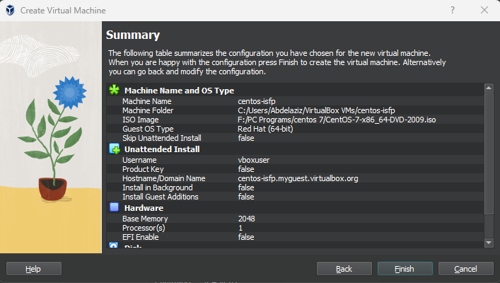

# ISFP DevOps TASK README


## Table of Contents

1. [Introduction](#introduction)
2. [Project Progress](#project-progress)

## Introduction

This project aims to provide a comprehensive guide for setting up a development environment on a CentOS 7.9 virtual machine (VM). The environment includes various components such as Apache Tomcat, Subversion (SVN), Maven, Apache, PHP, Payara Server, multiple versions of Java, WebLogic Server, Jenkins, Docker, and Ansible.

## Project Progress

- [x] `Done` - [001 - Install CentOS 7.9 as VM](#vm-installation-guide)
- [x] `Done` - [002 - Install Multiple Versions of Java](#java-installation-guide)
- [x] `Done` - [003 - Install Apache Tomcat 6.0.37.0 Application Server](#apache-tomcat-installation-guide)
<!-- - [x] `Done` - 002 - Install Apache Tomcat 6.0.37.0 Application Server
- [x] `Done` - 003 - Install Subversion (SVN)
- [x] `Done` - 004 - Download the latest version of Maven and configure its repository.
- [x] `Done` - 005 - Install Apache and PHP
- [x] `Done` - 006 - Create File Comparison Script
- [ ] `Progress` - 007 - Install Payara Server 5.191 #badassfish (build 94)
- 
- [x] `Done` - 009 - Install WebLogic Server 12.2.1.3.0
- [x] `Done` - 010 - Create Jenkins Server Based on Docker Image
- [x] `Done` - 011 - Create Maven Docker Compiler
- [x] `Done` - 012 - Create Jenkins Pipeline for Automated Compilation
- [x] `Done` - 013 - Launch Jenkins Downstream Pipeline with Ansible
- [x] `Done` - 014 - Configure Local Host Server with Ansible
- [x] `Done` - 015 - Deploy App on Tomcat Docker Container -->


## VM Installation Guide

<details>
<summary><b>Show more details</b></summary>

1. Download the CentOS 7.9 ISO Image From centos.interhost

    ```sh
    http://centos.interhost.net.il/7.9.2009/isos/x86_64/
    ```

2. Install Oracle VM Box From Oracle Download Page
    - For Windows users, download the appropriate Windows installer from the Oracle Download Page:

        ```sh
        https://www.oracle.com/eg/virtualization/technologies/vm/downloads/virtualbox-downloads.html
        ```

    - Note: If you are using a different operating system, make sure to download the version suitable for your OS.


<details>
<summary><b>Images</b></summary>

### 1. Adding a new virtual machine depends on our proper OS ISO (CentOS 7.9)


### 2. Adjusting our virtual machine's hardware (CPU, RAM) to fit our desires


### 3. Adjusting our virtual machine's hard disk that fit our desires


### 4. After finishing our configuration above, that is the summary table of our configuration that we have made



### 5. Let's run our centos-isfp VM , I prompted to mount the ISO file


### 6. At the boot menu, we chose to install CentOS 7.


### 7. At software selection, I chose a CentOS server with a GUI


### 8. Our Installation is now completed


### 9. Installation Progress..


### 10. CentOs is now successfully installed and ready to use


</details>
</details>

## Java Installation Guide

<details>
<summary><b>Show more details</b></summary>

# Install Multiple Versions of Java and Set Default (Java 8)
This Ansible playbook automates the installation of various Java versions on a target machine, with the earlier version (Java 8) set as the default. It gives developers the flexibility they need if their applications require different Java versions.
I choose to install Oracle Java (8,11) versions since WebLogic installation cannot be proceed because the open-jdk is no longer supported any more.

# Prerequisites
Ensure the following prerequisites are met before running the playbook:

- **Access to Oracle Java Archives:** Ensure access to the Oracle Java archives for Java 8 and Java 11 versions. The playbook uses direct download links to fetch these archives. and those direct links are temporary because to download from the Oracle page, you have to sign in and accept the Oracle OTN license and terms.
So I got those links from my login session; they have a limit 3 times only to be downloaded. Of course,  this is not the best approach. You can download them and upload them to a central server; you can use S3 buckets or any other service for example.
- **Ansible:**  Ensure Ansible is installed on the local system from which the playbook will be executed.
- **Target Host:**  The playbook assumes execution on the localhost, but it can be modified to target other hosts as needed.

# Playbook Structure


```yaml
- name: Install multiple versions of Java and set earlier one is the default (8)
  hosts: localhost
  become: yes
  vars:
    java8_download_url: https://download.oracle.com/otn/java/jdk/8u411-b09/43d62d619be4e416215729597d70b8ac/jdk-8u411-linux-x64.tar.gz?AuthParam=1715329607_1d701ac9a940bea9f0e903935ba46eb1
    java11_download_url: https://download.oracle.com/otn/java/jdk/11.0.23+7/9bd8d305c900ee4fa3e613b59e6f42de/jdk-11.0.23_linux-x64_bin.tar.gz?AuthParam=1715329784_6c64b1935760ee8cd8f61cc325d75b82
    download_folder: /tmp
    java_8_home: "/usr/local/jdk1.8.0_411"
    java_11_home: "/usr/local/jdk-11.0.23"
    java_8_archive: "{{download_folder}}/jdk-8u411-linux-x64.tar.gz"
    java_11_archive: "{{download_folder}}/jdk-11.0.23_linux-x64_bin.tar.gz"
    java_env_file: "/etc/profile.d/java.sh"
  tasks:
    - name: Check if Oracle Java 8 archive exists
      stat:
        path: "{{ java_8_archive }}"
      register: java_8_archive_stat

    - name: Check if Oracle Java 11 archive exists
      stat:
        path: "{{ java_11_archive }}"
      register: java_11_archive_stat

    - name: Download Oracle Java 8
      command: "curl -v -L -b oraclelicense=accept-securebackup-cookie -o {{java_8_archive}}  {{java8_download_url}}"
      when: java_8_archive_stat.stat.exists == False

    - name: Download Oracle Java 11
      command: "curl -v -L -b oraclelicense=accept-securebackup-cookie -o {{java_11_archive}}  {{java11_download_url}}"
      when: java_11_archive_stat.stat.exists == False

    - name: Unpack archive Oracle Java 8
      unarchive:
        src: "{{java_8_archive}}"
        dest: /usr/local
        remote_src: yes

    - name: Unpack archive Oracle Java 11
      unarchive:
        src: "{{java_11_archive}}"
        dest: /usr/local
        remote_src: yes

    - name: Install Oracle Java 8
      command: 'update-alternatives --install "/usr/bin/java" "java" "{{java_8_home}}/jre/bin/java" 1'
    - name: Install Oracle Java 11
      command: 'update-alternatives --install "/usr/bin/java" "java" "{{java_11_home}}/jre/bin/java" 1'
    - name: Set Oracle Java 8 as default
      command: "update-alternatives --set java {{java_8_home}}/jre/bin/java"

    - name: Create /etc/profile.d directory
      file:
        path: /etc/profile.d
        state: directory

    - name: Create java.sh file
      file:
        path: "{{java_env_file}}"
        state: touch

    - name: Clear content of java.sh file if it exists
      shell: echo "" > "{{ java_env_file }}"

    - name: Set environment variables for JAVA
      lineinfile:
        dest: "{{ java_env_file }}"
        line: |
          export JAVA_HOME={{java_8_home}}
          export PATH=$PATH:$JAVA_HOME/bin

    - name: Source java.sh script
      shell: source {{java_env_file}}
      args:
        executable: /bin/bash
```  


- **hosts:**  Specifies the target host where the playbook tasks will be executed. In this case, it's set to localhost.
- **vars:**   Defines variables used throughout the playbook, including download URLs for Java 8 and Java 11 archives, download folder location, installation paths, and environment file paths.
- **tasks:** Contains the main tasks of the playbook
  - **Check if Oracle Java archives exist:** Utilizes the `stat` module to check if the Java archives are already downloaded.
  - **Download Oracle Java archives:** Downloads the Java archives using `curl` commands if they don't already exist.
  - **Unpack archives:** Uses the `unarchive` module to extract the downloaded Java archives to the specified destination folder `(/opt)`.
  - **Install Java versions:** Uses `update-alternatives` to install Java versions and set up symbolic links to the Java executable.
  - **Set default Java version:** Uses `update-alternatives` Sets Java 8 as the default version using update-alternatives.
  - **Export environment variables:** Appends Java environment variables to the system-wide profile file (/etc/profile.d/java.sh) to make Java Home available globally.
  - **Source java.sh script:**  Sources the java.sh script to ensure the environment variables take effect immediately.


<details>
<summary><b>Images</b></summary>

### 1. Executing ansible playbook to our vm


### 2. update-alternatives --config java --> shows us the default java version which is openjdk-8


### 3. after installing ORACLE java , that is our JAVA_HOME Environment variable


### 4. Oracle Java Version


### 5. update-alternatives --config java --> shows us the default Java version, which is Oracle 8, that we have installed


</details>
</details>


## Apache Tomcat Installation Guide

<details>
<summary><b>Show more details</b></summary>
</details>
