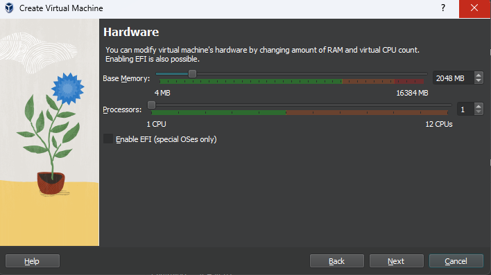

# ISFP DevOps TASK README


## :bulb: Table of Contents

1. [Introduction](#introduction)
2. [Project Progress](#project-progress)

## :reminder_ribbon: Introduction

This project aims to provide a comprehensive guide for setting up a development environment on a CentOS 7.9 virtual machine (VM). The environment includes various components such as Apache Tomcat, Subversion (SVN), Maven, Apache, PHP, Payara Server, multiple versions of Java, WebLogic Server, Jenkins, Docker, and Ansible.

## :pushpin: Project Progress

- [x] `Done` - [001 - Install CentOS 7.9 as VM](#vm-installation-guide)
- [x] `Done` - [002 - Install Multiple Versions of Java](#java-installation-guide)
- [x] `Done` - [003 - Install Apache Tomcat 6.0.37.0 Application Server](#apache-tomcat-installation-guide)
- [x] `Done` - [004 - Download the latest version of Maven and configure its repository.](#maven-installation-guide)
<!-- -
- [x] `Done` - 003 - Install Subversion (SVN)
- [x] `Done` - 005 - Install Apache and PHP
- [x] `Done` - 006 - Create File Comparison Script
- [ ] `Progress` - 007 - Install Payara Server 5.191 #badassfish (build 94)
- 
- [x] `Done` - 009 - Install WebLogic Server 12.2.1.3.0
- [x] `Done` - 010 - Create Jenkins Server Based on Docker Image
- [x] `Done` - 011 - Create Maven Docker Compiler
- [x] `Done` - 012 - Create Jenkins Pipeline for Automated Compilation
- [x] `Done` - 013 - Launch Jenkins Downstream Pipeline with Ansible
- [x] `Done` - 014 - Configure Local Host Server with Ansible
- [x] `Done` - 015 - Deploy App on Tomcat Docker Container -->


## :computer:  VM Installation Guide

<details>
<summary><b>Show more details</b></summary>

1. Download the CentOS 7.9 ISO Image From centos.interhost

    ```sh
    http://centos.interhost.net.il/7.9.2009/isos/x86_64/
    ```

2. Install Oracle VM Box From Oracle Download Page
    - For Windows users, download the appropriate Windows installer from the Oracle Download Page:

        ```sh
        https://www.oracle.com/eg/virtualization/technologies/vm/downloads/virtualbox-downloads.html
        ```

    - Note: If you are using a different operating system, make sure to download the version suitable for your OS.


<details>
<summary><b>Images</b></summary>

### 1. Adding a new virtual machine depends on our proper OS ISO (CentOS 7.9)


### 2. Adjusting our virtual machine's hardware (CPU, RAM) to fit our desires



### 3. Adjusting our virtual machine's hard disk that fit our desires


### 4. After finishing our configuration above, that is the summary table of our configuration that we have made


### 5. Let's run our centos-isfp VM , I prompted to mount the ISO file


### 6. At the boot menu, we chose to install CentOS 7.


### 7. At software selection, I chose a CentOS server with a GUI


### 8. Our Installation is now completed


### 9. Installation Progress..


### 10. CentOs is now successfully installed and ready to use


</details>
</details>

## :computer:  Java Installation Guide

<details>
<summary><b>Show more details</b></summary>

# Installing  Multiple Versions of Java and Set Default (Java 8)
This Ansible playbook automates the installation of various Java versions on a target machine, with the earlier version (Java 8) set as the default. It gives developers the flexibility they need if their applications require different Java versions.
I choose to install Oracle Java (8,11) versions since WebLogic installation cannot be proceed because the open-jdk is no longer supported any more.

# Prerequisites
Ensure the following prerequisites are met before running the playbook:

- **Access to Oracle Java Archives:** Ensure access to the Oracle Java archives for Java 8 and Java 11 versions. The playbook uses direct download links to fetch these archives. and those direct links are temporary because to download from the Oracle page, you have to sign in and accept the Oracle OTN license and terms.
So I got those links from my login session; they have a limit 3 times only to be downloaded. Of course,  this is not the best approach. You can download them and upload them to a central server; you can use S3 buckets or any other service for example.
- **Ansible:**  Ensure Ansible is installed on the local system from which the playbook will be executed.
- **Target Host:**  The playbook assumes execution on the localhost, but it can be modified to target other hosts as needed.

# Playbook Structure


```yaml
- name: Install multiple versions of Java and set earlier one is the default (8)
  hosts: localhost
  become: yes
  vars:
    java8_download_url: https://download.oracle.com/otn/java/jdk/8u411-b09/43d62d619be4e416215729597d70b8ac/jdk-8u411-linux-x64.tar.gz?AuthParam=1715329607_1d701ac9a940bea9f0e903935ba46eb1
    java11_download_url: https://download.oracle.com/otn/java/jdk/11.0.23+7/9bd8d305c900ee4fa3e613b59e6f42de/jdk-11.0.23_linux-x64_bin.tar.gz?AuthParam=1715329784_6c64b1935760ee8cd8f61cc325d75b82
    download_folder: /tmp
    java_8_home: "/usr/local/jdk1.8.0_411"
    java_11_home: "/usr/local/jdk-11.0.23"
    java_8_archive: "{{download_folder}}/jdk-8u411-linux-x64.tar.gz"
    java_11_archive: "{{download_folder}}/jdk-11.0.23_linux-x64_bin.tar.gz"
    java_env_file: "/etc/profile.d/java.sh"
  tasks:
    - name: Check if Oracle Java 8 archive exists
      stat:
        path: "{{ java_8_archive }}"
      register: java_8_archive_stat

    - name: Check if Oracle Java 11 archive exists
      stat:
        path: "{{ java_11_archive }}"
      register: java_11_archive_stat

    - name: Download Oracle Java 8
      command: "curl -v -L -b oraclelicense=accept-securebackup-cookie -o {{java_8_archive}}  {{java8_download_url}}"
      when: java_8_archive_stat.stat.exists == False

    - name: Download Oracle Java 11
      command: "curl -v -L -b oraclelicense=accept-securebackup-cookie -o {{java_11_archive}}  {{java11_download_url}}"
      when: java_11_archive_stat.stat.exists == False

    - name: Unpack archive Oracle Java 8
      unarchive:
        src: "{{java_8_archive}}"
        dest: /usr/local
        remote_src: yes

    - name: Unpack archive Oracle Java 11
      unarchive:
        src: "{{java_11_archive}}"
        dest: /usr/local
        remote_src: yes

    - name: Install Oracle Java 8
      command: 'update-alternatives --install "/usr/bin/java" "java" "{{java_8_home}}/jre/bin/java" 1'
    - name: Install Oracle Java 11
      command: 'update-alternatives --install "/usr/bin/java" "java" "{{java_11_home}}/jre/bin/java" 1'
    - name: Set Oracle Java 8 as default
      command: "update-alternatives --set java {{java_8_home}}/jre/bin/java"

    - name: Create /etc/profile.d directory
      file:
        path: /etc/profile.d
        state: directory

    - name: Create java.sh file
      file:
        path: "{{java_env_file}}"
        state: touch

    - name: Clear content of java.sh file if it exists
      shell: echo "" > "{{ java_env_file }}"

    - name: Set environment variables for JAVA
      lineinfile:
        dest: "{{ java_env_file }}"
        line: |
          export JAVA_HOME={{java_8_home}}
          export PATH=$PATH:$JAVA_HOME/bin

    - name: Source java.sh script
      shell: source {{java_env_file}}
      args:
        executable: /bin/bash
```  


- **hosts:**  Specifies the target host where the playbook tasks will be executed. In this case, it's set to localhost.
- **vars:**   Defines variables used throughout the playbook, including download URLs for Java 8 and Java 11 archives, download folder location, installation paths, and environment file paths.
- **tasks:** Contains the main tasks of the playbook
  - **Check if Oracle Java archives exist:** Utilizes the `stat` module to check if the Java archives are already downloaded.
  - **Download Oracle Java archives:** Downloads the Java archives using `curl` commands if they don't already exist.
  - **Unpack archives:** Uses the `unarchive` module to extract the downloaded Java archives to the specified destination folder `(/usr/local)`.
  - **Install Java versions:** Uses `update-alternatives` to install Java versions and set up symbolic links to the Java executable.
  - **Set default Java version:** Uses `update-alternatives` Sets Java 8 as the default version using update-alternatives.
  - **Export environment variables:** Appends Java environment variables to the system-wide profile file `(/etc/profile.d/java.sh)` to make Java Home available globally.
  - **Source java.sh script:**  Sources the java.sh script to ensure the environment variables take effect immediately.


<details>
<summary><b>Images</b></summary>

### 1. Executing ansible playbook to our vm


### 2. update-alternatives --config java --> shows us the default java version which is openjdk-8


### 3. after installing ORACLE java , that is our JAVA_HOME Environment variable


### 4. Oracle Java Version


### 5. update-alternatives --config java --> shows us the default Java version, which is Oracle 8, that we have installed


</details>
</details>


##  :computer: Apache Tomcat Installation Guide

<details>
<summary><b>Show more details</b></summary>

# Installing Apache Tomcat (6.0.37)

This Ansible playbook automates the installation of Apache Tomcat version 6.0.37 on our local machine. It performs the following steps:


# Prerequisites

Ensure the following prerequisites are met before running the playbook:

- **Access to Apache Tomcat Archive:** Ensure access to the Apache Tomcat archives for 6.0.37. The playbook uses direct download link to fetch this archive. 
- **Ansible:**  Ensure Ansible is installed on the local system from which the playbook will be executed.
- **Target Host:**  The playbook assumes execution on the localhost, but it can be modified to target other hosts as needed.

# Playbook Structure

```yaml
- name: Install Apache Tomcat 6.0.37
  hosts: localhost
  become: yes
  vars:
    download_url: https://archive.apache.org/dist/tomcat/tomcat-6/v6.0.37/bin/apache-tomcat-6.0.37.tar.gz
    download_folder: /tmp
    tomcat_installation_path: "/opt/tomcat"
    tomcat_home: "/opt/tomcat/apache-tomcat-6.0.37"
    tomcat_archive: "{{download_folder}}/apache-tomcat-6.0.37.tar.gz"
  tasks:
    - name: Create tomcat directory
      file:
        path: "{{tomcat_installation_path}}"
        state: directory

    - name: Download Apache Tomcat
      get_url:
        url: "{{download_url}}"
        dest: "{{tomcat_archive}}"

    - name: Extract Apache Tomcat
      unarchive:
        src: "{{tomcat_archive}}"
        dest: "{{tomcat_installation_path}}"
        remote_src: yes

    - name: Change permissions of startup.sh
      file:
        path: "{{tomcat_home}}/bin/startup.sh"
        mode: +x

    - name: Change Tomcat connector port to 8088
      replace:
        path: "{{tomcat_home}}/conf/server.xml"
        regexp: 'port="8080"'
        replace: 'port="8088"'

    - name: Change Tomcat Shutdown Port 8005 > 8006
      replace:
        path: "{{tomcat_home}}/conf/server.xml"
        regexp: 'port="8005"'
        replace: 'port="8006"'

    - name: Change Tomcat Connector Port for AJP 8009 > 8010
      replace:
        path: "{{tomcat_home}}/conf/server.xml"
        regexp: 'port="8009"'
        replace: 'port="8010"'

    - name: Create tomcat-users.xml file
      template:
        src: "./tomcat/tomcat-users.xml"
        dest: "{{tomcat_home}}/conf/tomcat-users.xml"

    - name: Start Tomcat service using startup.sh
      command: sh "{{tomcat_home}}/bin/startup.sh"

    - name: Check if Tomcat service is running
      shell: ps aux | grep '[c]atalina.home=/opt/tomcat'
      register: tomcat_status
      ignore_errors: yes

    - name: Debug message Tomcat status
      debug:
        msg: "Tomcat is {{ 'running' if tomcat_status.rc == 0 else 'not running' }}"
```  

- **hosts:**  Specifies the target host where the playbook tasks will be executed. In this case, it's set to localhost.
- **vars:**   Defines variables used throughout the playbook, including download URL Apache tomcat archive, download folder location, installation paths, and environment file paths.
- **tasks:** Contains the main tasks of the playbook
  - **Create Tomcat Directory:** It creates the directory where Apache Tomcat will be installed.
  - **Download Apache Tomcat Archive:** It downloads the Apache Tomcat archive distribution from the provided URL and saves it to a specified folder.
  - **Extract Apache Tomcat:** It extracts the downloaded Apache Tomcat archive to the installation directory.
  - **Change Permissions of startup.sh:**  It changes the permissions of the Tomcat startup script to make it executable.
  - **Change Tomcat Connector Port** It modifies the configuration file to change the default connector port from `8080` to `8088`.
  - **Modify Tomcat Shutdown Port:**  It modifies the configuration file to change the shutdown port from `8005` to `8006`.
  - **Modify Tomcat Connector Port for AJP:**  It modifies the configuration file to change the port used for the AJP connector from `8009` to `8010`.
  - **Create tomcat-users.xml File:**   It creates a tomcat-users.xml file in the Tomcat configuration directory to define user roles and access privileges.

    ```diff
    <?xml version='1.0' encoding='utf-8'?>
    <!--
    Licensed to the Apache Software Foundation (ASF) under one or more
    contributor license agreements.  See the NOTICE file distributed with
    this work for additional information regarding copyright ownership.
    The ASF licenses this file to You under the Apache License, Version 2.0
    (the "License"); you may not use this file except in compliance with
    the License.  You may obtain a copy of the License at

        http://www.apache.org/licenses/LICENSE-2.0

    Unless required by applicable law or agreed to in writing, software
    distributed under the License is distributed on an "AS IS" BASIS,
    WITHOUT WARRANTIES OR CONDITIONS OF ANY KIND, either express or implied.
    See the License for the specific language governing permissions and
    limitations under the License.
    -->
    <tomcat-users>
    <!--
    NOTE:  By default, no user is included in the "manager-gui" role required
    to operate the "/manager/html" web application.  If you wish to use this app,
    you must define such a user - the username and password are arbitrary.
    -->
    <!--
    NOTE:  The sample user and role entries below are wrapped in a comment
    and thus are ignored when reading this file. Do not forget to remove
    <!.. ..> that surrounds them.
    -->
    <!--
    <role rolename="tomcat"/>
    <role rolename="role1"/>
    <user username="tomcat" password="tomcat" roles="manager-gui,admin-gui"/>
    <user username="both" password="tomcat" roles="tomcat,role1"/>
    <user username="role1" password="tomcat" roles="role1"/>
    -->
    + <user username="tomcat" password="tomcat" roles="manager-gui,admin-gui"/>
    </tomcat-users>
    ```

  - **Start Tomcat Service:**  It starts the Tomcat service using the `startup.sh` script.
  - **Check Tomcat Service Status:** It verifies whether the Tomcat service is running by searching for the process using ps command.
  - **Debug Message:** It provides a debug message indicating whether Tomcat is running or not.


  


<details>
<summary><b>Images</b></summary>

### 1. Executing ansible playbook to our vm


### 2. Accessing our apache tomcat from our VM


### 3. Accessing our apache tomcat from my computer which host the VM


> Assuming that our virtual machine (VM) is accessible to the public, I wanted to emulate the process, so I used the command `sudo firewall-cmd --zone=public --add-port=8088/tcp to open port 8080 within our VM. I also adjusted the VM network settings from our oracle VMbox to port forward from my host machine to the VM (guest) port.


### 4. Trying to login into manager page


### 5. I logged in successfully


### 6. Apache tomcat server status


</details>
</details>


## :computer: Maven Installation Guide

<details>
<summary><b>Show more details</b></summary>

# Installing Maven Latest Version (3.9.6)

This Ansible playbook automates the installation of Apache Maven version 3.9.6 on our local machine. It performs the following steps:

# Prerequisites

Ensure the following prerequisites are met before running the playbook:

- **Access to Apache Maven Archive:** Ensure access to the Apache Maven archives for 3.9.6. The playbook uses direct download link to fetch this archive.
- **Ansible:**  Ensure Ansible is installed on the local system from which the playbook will be executed.
- **Target Host:**  The playbook assumes execution on the localhost, but it can be modified to target other hosts as needed.

# Playbook Structure

```yaml
- name: Install Apache Maven and configure environment
  hosts: localhost
  become: yes
  vars:
    download_url: https://dlcdn.apache.org/maven/maven-3/3.9.6/binaries/apache-maven-3.9.6-bin.tar.gz
    download_folder: /tmp
    maven_installation_path: "/opt/maven"
    maven_home: "/opt/maven/apache-maven-3.9.6"
    maven_archive: "{{download_folder}}/apache-maven-3.9.6-bin.tar.gz"
    maven_env_file: "/etc/profile.d/maven.sh"

  tasks:
    - name: Download Maven
      get_url:
        url: "{{ download_url }}"
        dest: "{{ maven_archive }}"

    - name: Create maven.sh
      file:
        path: "{{ maven_installation_path }}"
        state: directory

    - name: Extract Maven
      unarchive:
        src: "{{ maven_archive }}"
        dest: "{{ maven_installation_path }}"
        creates: "{{ maven_home }}"
        remote_src: yes

    - name: Create maven.sh
      file:
        path: "{{ maven_env_file }}"
        state: touch

    - name: Clear content of maven.sh file if it exists
      shell: echo "" > "{{ maven_env_file }}"

    - name: Set environment variables for Maven
      lineinfile:
        dest: "{{ maven_env_file }}"
        line: "{{ item }}"
      with_items:
        - "export M2_HOME={{maven_home}}"
        - "export PATH=$PATH:$M2_HOME/bin"

    - name: Configure maven repo to use local repo
      copy:
        src: "./maven/settings.xml"
        dest: "{{ maven_home }}/conf/settings.xml"

    - name: Source maven.sh script
      shell: source {{ maven_env_file }}
      args:
        executable: /bin/bash
```  

- **hosts:**  Specifies the target host where the playbook tasks will be executed. In this case, it's set to localhost.
- **vars:**   Defines variables used throughout the playbook, including download URL Apache tomcat archive, download folder location, installation paths, and environment file paths.
- **tasks:** Contains the main tasks of the playbook
  - **Create Tomcat Directory:** It creates the directory where Apache Tomcat will be installed.
  - **Download Apache Tomcat Archive:** It downloads the Apache Tomcat archive distribution from the provided URL and saves it to a specified folder.
  - **Extract Apache Tomcat:** It extracts the downloaded Apache Tomcat archive to the installation directory.
  - **Change Permissions of startup.sh:**  It changes the permissions of the Tomcat startup script to make it executable.
  - **Change Tomcat Connector Port** It modifies the configuration file to change the default connector port from `8080` to `8088`.
  - **Modify Tomcat Shutdown Port:**  It modifies the configuration file to change the shutdown port from `8005` to `8006`.
  - **Modify Tomcat Connector Port for AJP:**  It modifies the configuration file to change the port used for the AJP connector from `8009` to `8010`.
  - **Create tomcat-users.xml File:**   It creates a tomcat-users.xml file in the Tomcat configuration directory to define user roles and access privileges.

    ```diff
    <!--

    Licensed to the Apache Software Foundation (ASF) under one
    or more contributor license agreements.  See the NOTICE file
    distributed with this work for additional information
    regarding copyright ownership.  The ASF licenses this file
    to you under the Apache License, Version 2.0 (the
    "License"); you may not use this file except in compliance
    with the License.  You may obtain a copy of the License at

        http://www.apache.org/licenses/LICENSE-2.0

    Unless required by applicable law or agreed to in writing,
    software distributed under the License is distributed on an
    "AS IS" BASIS, WITHOUT WARRANTIES OR CONDITIONS OF ANY
    KIND, either express or implied.  See the License for the
    specific language governing permissions and limitations
    under the License.
    -->
    <!--

    | This is the configuration file for Maven. It can be specified at two levels:
    |
    |  1. User Level. This settings.xml file provides configuration for a single user,
    |                 and is normally provided in ${user.home}/.m2/settings.xml.
    |
    |                 NOTE: This location can be overridden with the CLI option:
    |
    |                 -s /path/to/user/settings.xml
    |
    |  2. Global Level. This settings.xml file provides configuration for all Maven
    |                 users on a machine (assuming they're all using the same Maven
    |                 installation). It's normally provided in
    |                 ${maven.conf}/settings.xml.
    |
    |                 NOTE: This location can be overridden with the CLI option:
    |
    |                 -gs /path/to/global/settings.xml
    |
    | The sections in this sample file are intended to give you a running start at
    | getting the most out of your Maven installation. Where appropriate, the default
    | values (values used when the setting is not specified) are provided.
    |
    |
    -->
    <settings xsi:schemaLocation="http://maven.apache.org/SETTINGS/1.2.0 https://maven.apache.org/xsd/settings-1.2.0.xsd">
    <!--
    localRepository
    | The path to the local repository maven will use to store artifacts.
    |
    | Default: ${user.home}/.m2/repository
    
    
    -->
   + <localRepository>${user.home}/.m2/repository</localRepository>
    <!--
    interactiveMode
    | This will determine whether maven prompts you when it needs input. If set to false,
    | maven will use a sensible default value, perhaps based on some other setting, for
    | the parameter in question.
    |
    | Default: true
    <interactiveMode>true</interactiveMode>
    
    -->
    <!--
    offline
    | Determines whether maven should attempt to connect to the network when executing a build.
    | This will have an effect on artifact downloads, artifact deployment, and others.
    |
    | Default: false
    <offline>false</offline>
    
    -->
    <!--
    pluginGroups
    | This is a list of additional group identifiers that will be searched when resolving plugins by their prefix, i.e.
    | when invoking a command line like "mvn prefix:goal". Maven will automatically add the group identifiers
    | "org.apache.maven.plugins" and "org.codehaus.mojo" if these are not already contained in the list.
    |
    -->
    <pluginGroups>
    <!--
    pluginGroup
        | Specifies a further group identifier to use for plugin lookup.
        <pluginGroup>com.your.plugins</pluginGroup>
        
    -->
    </pluginGroups>
    <!--
    TODO Since when can proxies be selected as depicted? 
    -->
    <!--
    proxies
    | This is a list of proxies which can be used on this machine to connect to the network.
    | Unless otherwise specified (by system property or command-line switch), the first proxy
    | specification in this list marked as active will be used.
    |
    -->
    <proxies>
    <!--
    proxy
        | Specification for one proxy, to be used in connecting to the network.
        |
        <proxy>
        <id>optional</id>
        <active>true</active>
        <protocol>http</protocol>
        <username>proxyuser</username>
        <password>proxypass</password>
        <host>proxy.host.net</host>
        <port>80</port>
        <nonProxyHosts>local.net|some.host.com</nonProxyHosts>
        </proxy>
        
    -->
    </proxies>
    <!--
    servers
    | This is a list of authentication profiles, keyed by the server-id used within the system.
    | Authentication profiles can be used whenever maven must make a connection to a remote server.
    |
    -->
    <servers>
    <!--
    server
        | Specifies the authentication information to use when connecting to a particular server, identified by
        | a unique name within the system (referred to by the 'id' attribute below).
        |
        | NOTE: You should either specify username/password OR privateKey/passphrase, since these pairings are
        |       used together.
        |
        <server>
        <id>deploymentRepo</id>
        <username>repouser</username>
        <password>repopwd</password>
        </server>
        
    -->
    <!--
    Another sample, using keys to authenticate.
        <server>
        <id>siteServer</id>
        <privateKey>/path/to/private/key</privateKey>
        <passphrase>optional; leave empty if not used.</passphrase>
        </server>
        
    -->
    </servers>
    <!--
    mirrors
    | This is a list of mirrors to be used in downloading artifacts from remote repositories.
    |
    | It works like this: a POM may declare a repository to use in resolving certain artifacts.
    | However, this repository may have problems with heavy traffic at times, so people have mirrored
    | it to several places.
    |
    | That repository definition will have a unique id, so we can create a mirror reference for that
    | repository, to be used as an alternate download site. The mirror site will be the preferred
    | server for that repository.
    |
    -->
    <mirrors>
    <!--
    mirror
        | Specifies a repository mirror site to use instead of a given repository. The repository that
        | this mirror serves has an ID that matches the mirrorOf element of this mirror. IDs are used
        | for inheritance and direct lookup purposes, and must be unique across the set of mirrors.
        |
        <mirror>
        <id>mirrorId</id>
        <mirrorOf>repositoryId</mirrorOf>
        <name>Human Readable Name for this Mirror.</name>
        <url>http://my.repository.com/repo/path</url>
        </mirror>
        
    -->
    <mirror>
    <id>maven-default-http-blocker</id>
    <mirrorOf>external:http:*</mirrorOf>
    <name>
    Pseudo repository to mirror external repositories initially using HTTP.
    </name>
    <url>http://0.0.0.0/</url>
    <blocked>true</blocked>
    </mirror>
    </mirrors>
    <!--
    profiles
    | This is a list of profiles which can be activated in a variety of ways, and which can modify
    | the build process. Profiles provided in the settings.xml are intended to provide local machine-
    | specific paths and repository locations which allow the build to work in the local environment.
    |
    | For example, if you have an integration testing plugin - like cactus - that needs to know where
    | your Tomcat instance is installed, you can provide a variable here such that the variable is
    | dereferenced during the build process to configure the cactus plugin.
    |
    | As noted above, profiles can be activated in a variety of ways. One way - the activeProfiles
    | section of this document (settings.xml) - will be discussed later. Another way essentially
    | relies on the detection of a property, either matching a particular value for the property,
    | or merely testing its existence. Profiles can also be activated by JDK version prefix, where a
    | value of '1.4' might activate a profile when the build is executed on a JDK version of '1.4.2_07'.
    | Finally, the list of active profiles can be specified directly from the command line.
    |
    | NOTE: For profiles defined in the settings.xml, you are restricted to specifying only artifact
    |       repositories, plugin repositories, and free-form properties to be used as configuration
    |       variables for plugins in the POM.
    |
    |
    -->
    <profiles>
    <!--
    profile
        | Specifies a set of introductions to the build process, to be activated using one or more of the
        | mechanisms described above. For inheritance purposes, and to activate profiles via <activatedProfiles/>
        | or the command line, profiles have to have an ID that is unique.
        |
        | An encouraged best practice for profile identification is to use a consistent naming convention
        | for profiles, such as 'env-dev', 'env-test', 'env-production', 'user-jdcasey', 'user-brett', etc.
        | This will make it more intuitive to understand what the set of introduced profiles is attempting
        | to accomplish, particularly when you only have a list of profile id's for debug.
        |
        | This profile example uses the JDK version to trigger activation, and provides a JDK-specific repo.
        <profile>
        <id>jdk-1.4</id>

        <activation>
            <jdk>1.4</jdk>
        </activation>

        <repositories>
            <repository>
            <id>jdk14</id>
            <name>Repository for JDK 1.4 builds</name>
            <url>http://www.myhost.com/maven/jdk14</url>
            <layout>default</layout>
            <snapshotPolicy>always</snapshotPolicy>
            </repository>
        </repositories>
        </profile>
        
    -->
    <!--

        | Here is another profile, activated by the property 'target-env' with a value of 'dev', which
        | provides a specific path to the Tomcat instance. To use this, your plugin configuration might
        | hypothetically look like:
        |
        | ...
        | <plugin>
        |   <groupId>org.myco.myplugins</groupId>
        |   <artifactId>myplugin</artifactId>
        |
        |   <configuration>
        |     <tomcatLocation>${tomcatPath}</tomcatLocation>
        |   </configuration>
        | </plugin>
        | ...
        |
        | NOTE: If you just wanted to inject this configuration whenever someone set 'target-env' to
        |       anything, you could just leave off the <value/> inside the activation-property.
        |
        <profile>
        <id>env-dev</id>

        <activation>
            <property>
            <name>target-env</name>
            <value>dev</value>
            </property>
        </activation>

        <properties>
            <tomcatPath>/path/to/tomcat/instance</tomcatPath>
        </properties>
        </profile>
        
    -->
    </profiles>
    <!--
    activeProfiles
    | List of profiles that are active for all builds.
    |
    <activeProfiles>
        <activeProfile>alwaysActiveProfile</activeProfile>
        <activeProfile>anotherAlwaysActiveProfile</activeProfile>
    </activeProfiles>
    
    -->
    </settings>
    ```

  - **Start Tomcat Service:**  It starts the Tomcat service using the `startup.sh` script.
  - **Check Tomcat Service Status:** It verifies whether the Tomcat service is running by searching for the process using ps command.
  - **Debug Message:** It provides a debug message indicating whether Tomcat is running or not.

<details>
<summary><b>Images</b></summary>

### 1. Executing ansible playbook to our vm


### 2. Accessing our apache tomcat from our VM


### 3. Accessing our apache tomcat from my computer which host the VM


> Assuming that our virtual machine (VM) is accessible to the public, I wanted to emulate the process, so I used the command `sudo firewall-cmd --zone=public --add-port=8088/tcp to open port 8080 within our VM. I also adjusted the VM network settings from our oracle VMbox to port forward from my host machine to the VM (guest) port.


### 4. Trying to login into manager page


### 5. I logged in successfully


### 6. Apache tomcat server status


</details>
</details>
